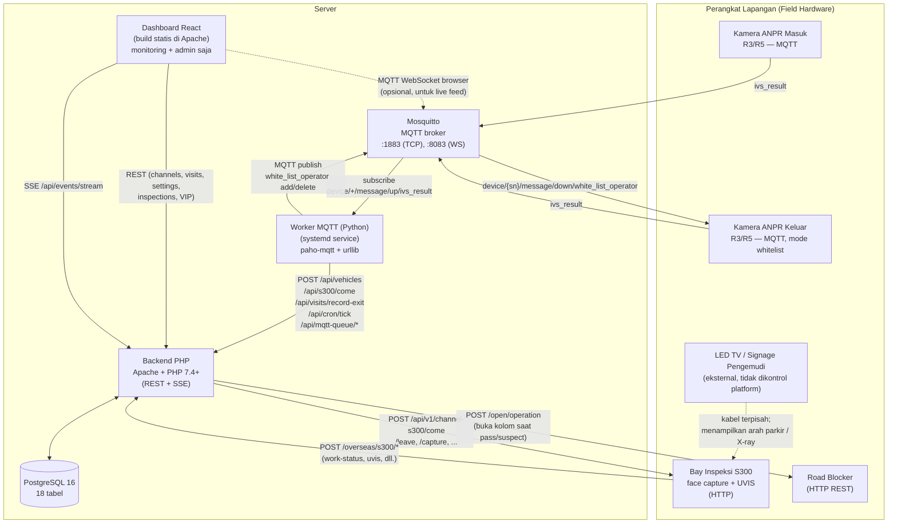
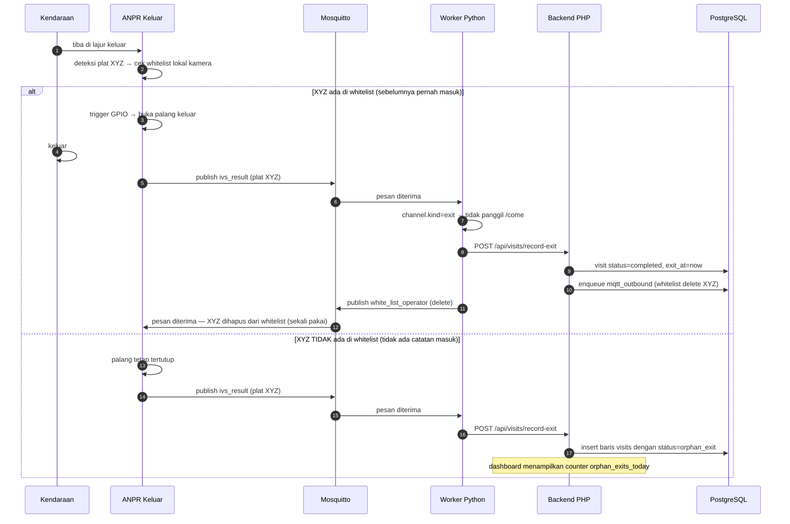
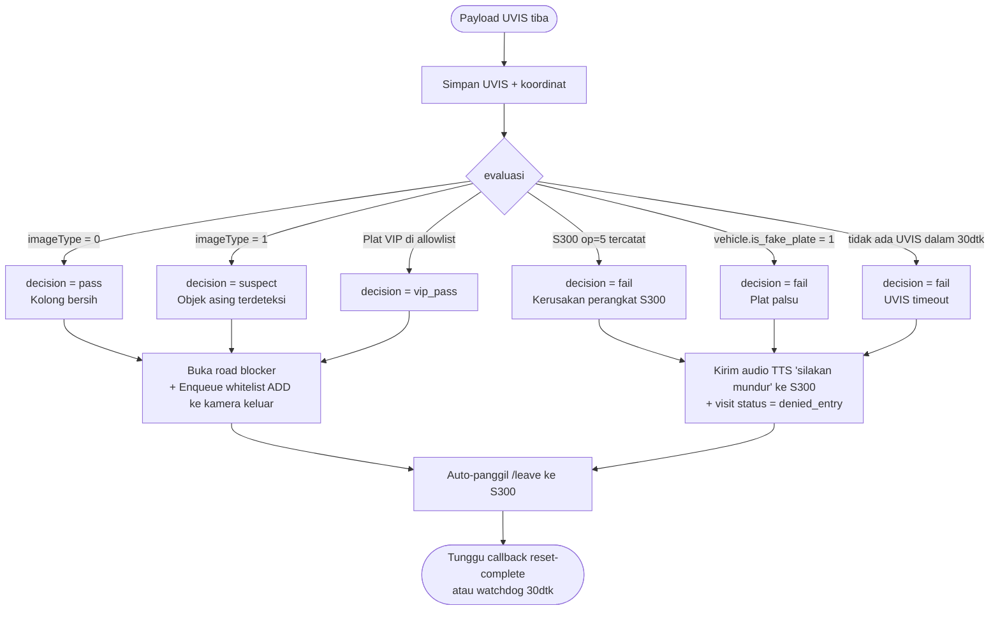
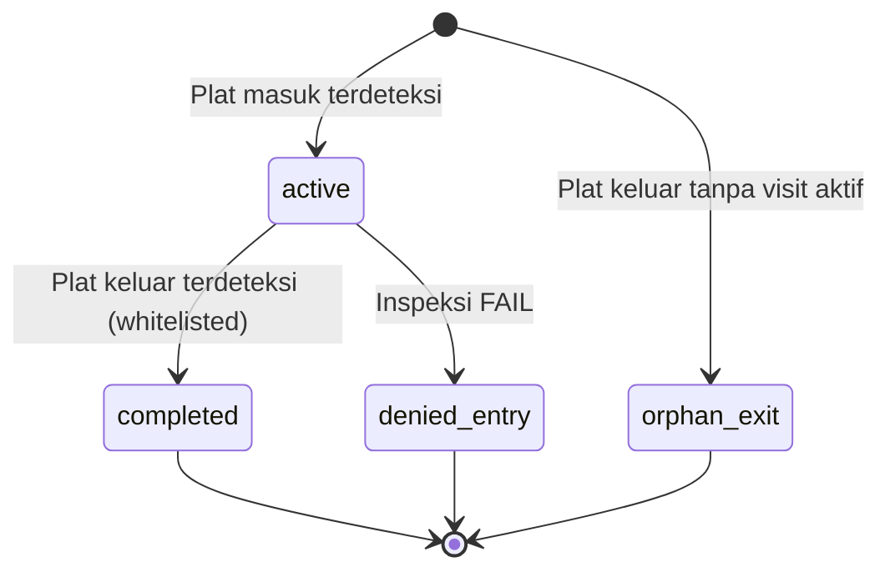

# Arsitektur Sistem — Platform ANPR + S300

> Diagram menggunakan [Mermaid](https://mermaid.js.org/) — otomatis ter-render di GitHub
> dan di VS Code dengan extension "Markdown Preview Mermaid Support".

## 1. Gambaran Komponen



## 2. Komponen — Ringkasan

| Komponen | Fungsi | Teknologi | Kritis untuk runtime? |
|---|---|---|---|
| **Mosquitto** | MQTT broker, jembatan antara kamera dan worker | C broker, native | **Ya** — tanpa ini tidak ada plat masuk |
| **Worker Python** | Satu-satunya pemicu otomasi: subscribe MQTT, drive REST, publish MQTT keluar | Python 3.10+, paho-mqtt | **Ya** — tanpa ini tidak ada otomasi |
| **Backend PHP** | REST API, decision engine, panggilan road blocker, callback S300 | PHP 7.4+ dengan `pdo_pgsql`, Apache, vanilla (tanpa Composer) | **Ya** — semua aksi lewat sini |
| **PostgreSQL** | Status: channels, inspections, visits, VIP, antrian, log | PostgreSQL 13+ (16 direkomendasikan; Docker atau native) | **Ya** |
| **Dashboard React** | Monitoring + admin (channels, VIP, settings, laporan) | React 19 + Vite + Tailwind 4 | **Tidak** — sistem berjalan headless |

## 3. Alur Kendaraan Masuk — Sequence End-to-End

```mermaid
sequenceDiagram
  autonumber
  participant V as Kendaraan
  participant E as ANPR Masuk
  participant M as Mosquitto
  participant W as Worker Python
  participant B as Backend PHP
  participant DB as PostgreSQL
  participant S as S300
  participant RB as Road Blocker
  participant X as ANPR Keluar

  V->>E: tiba di gerbang masuk
  E->>E: deteksi plat, buka palang masuk (logic lokal kamera)
  E->>M: publish ivs_result (plat XYZ)
  M->>W: pesan diterima
  W->>B: POST /api/vehicles (audit log)
  W->>B: GET /api/channels/by-no/RJ001/status
  B-->>W: busy=false
  W->>B: POST /api/s300/come/RJ001 {licensePlateNo:XYZ}

  alt Plat VIP
    B->>DB: insert inspection (vip_pass) + visit + enqueue whitelist add
    B-->>W: 200 vip
  else Bukan VIP
    B->>DB: insert inspection (state=started) + visit (active)
    B->>S: POST /api/v1/channel-s300/come/RJ001
    S-->>B: 200
  end

  V->>V: melaju ke bay inspeksi (scan UVIS, palang menutup)
  S->>B: POST /overseas/s300/work-status op=1 (inspecting)
  S->>B: POST /overseas/s300/face-image (URL gambar)
  S->>B: POST /overseas/s300/uvis (gambar + koordinat)
  B->>B: DecisionEngine mengevaluasi
  Note over B: Aturan:<br/>imageType=0 → pass<br/>imageType=1 → suspect<br/>op=5 / plat palsu / timeout 30dtk → fail

  alt pass / suspect / vip
    B->>RB: POST /open/operation (action=down) — buka road blocker
    B->>DB: enqueue mqtt_outbound (whitelist add XYZ → SN kamera keluar)
    W->>DB: poll mqtt_outbound (pending)
    W->>M: publish device/{exit_sn}/message/down/white_list_operator (add)
    M->>X: pesan diterima
    X->>X: simpan XYZ ke whitelist lokal kamera
    B->>S: GET /api/v1/channel-s300/leave/RJ001 (otomatis)
    S->>B: POST /overseas/s300/work-status op=2 → op=3
    S->>B: POST /overseas/s300/reset-complete
    B->>DB: inspection state=completed, channel bebas
    V->>V: road blocker terbuka → menuju area parkir
  else fail
    B->>S: POST audio-prompt (pesan mundur)
    B->>DB: visit status=denied_entry
    B->>S: GET /api/v1/channel-s300/leave (otomatis)
    Note over V: road blocker tetap naik; kendaraan harus mundur
  end
```

## 4. Alur Kendaraan Keluar — Sequence End-to-End



## 5. Logika Keputusan (Decision Logic)



## 6. State Machine Visit



## 7. Inspection `state` vs S300 `operating_state`

Dua kolom berbeda dengan siklus berbeda — pemisahan ini memperbaiki race
condition yang dulu menyebabkan phantom completion:

```
Platform `state`                  S300 `current_operating_state`
─────────────────                 ──────────────────────────────
pending  (dialokasikan, /come belum)
started  (/come terkirim)
inspecting  ← op=1                0  (Ready — di antara kendaraan)
resetting   (setelah /leave)      1  (Inspecting)
completed   (reset-complete)      2  (Resetting)
emergency_stop                    3  (Reset complete)
failed                            4  (Emergency stop)
vip_skipped                       5  (Equipment failure)
denied_entry  (decision=fail)     6  (Self-test)
```

- `state` digerakkan oleh **event platform**: `/come`, `/leave`, callback `reset-complete`.
- `current_operating_state` hanya **cerminan** push work-status terakhir.
- Work-status sendirian **tidak** mengubah `state` (kecuali untuk kegagalan terminal op=4 / op=5).

## 8. Skema Database (level tinggi)

| Tabel | Tujuan |
|---|---|
| `channels` | Satu baris per lajur / gerbang (masuk atau keluar) — dipasangkan via `paired_channel_id` |
| `vehicles` | Audit log setiap deteksi plat ANPR (masuk dan keluar) |
| `visits` | Satu baris per siklus "masuk → keluar". Status: active, completed, orphan_exit, denied_entry |
| `inspections` | Satu baris per siklus inspeksi S300 |
| `inspection_status_logs` | Setiap push work-status dari S300 |
| `inspection_face_images` | URL foto wajah |
| `inspection_video_streams` | Alamat stream RTSP untuk 6 kamera lengan robot |
| `inspection_uvis` + `_coords` | Gambar scan kolong + bounding box objek asing |
| `inspection_xray` + `_alarms` | Inspeksi X-ray (diterima tapi tidak dipakai di deployment ini) |
| `vip_plates` | Daftar plat yang lewati inspeksi S300 |
| `audio_prompts` | Audio kustom yang dipush ke S300 |
| `users` | Akun operator |
| `operation_log` | Audit trail setiap aksi backend |
| `settings` | Setting key-value sistem (`auto_start_s300`, `auto_start_channel`) |
| `inbound_events_raw` | Callback S300 mentah (untuk debugging/replay) |
| `mqtt_outbound_queue` | Perintah MQTT pending yang harus dipublish worker |

## 9. Permukaan API (Backend PHP)

### Inbound (S300 memanggil platform di endpoint ini)
- `POST /overseas/s300/work-status` — update operatingState (cmdNo 322)
- `POST /overseas/s300/face-image` — URL foto wajah (cmdNo 323)
- `POST /overseas/s300/video-record` — RTSP 6 kamera (cmdNo 325)
- `POST /overseas/s300/uvis` — scan kolong (memicu keputusan)
- `POST /overseas/s300/reset-complete` — peralatan selesai reset (cmdNo 326)
- `POST /overseas/s300/x-ray` — scan X-ray (di-log, tidak dipakai)

### Outbound (platform → S300, via proxy backend)
- `POST /api/s300/come/{channelNo}` — mulai inspeksi
- `GET  /api/s300/capture/{channelNo}` — ambil ulang snapshot
- `GET  /api/s300/leave/{channelNo}` — selesaikan inspeksi
- `POST /api/s300/read-work-status/{channelNo}`
- `POST /api/s300/emergency-stop/{channelNo}`
- `POST /api/s300/manual-reset/{channelNo}`
- `POST /api/s300/x-ray/{channelNo}` — kirim resi pass/fail X-ray
- `POST /api/s300/audio-prompt` — set audio kustom
- `POST /api/s300/video-playback` — ambil RTSP untuk rentang waktu

### Internal (dashboard + worker)
- `GET/POST/PUT/DELETE /api/channels` + `/api/channels/by-no/{ch}/status`
- `GET /api/inspections`, `GET /api/inspections/{id}`
- `GET/POST /api/vehicles`
- `GET/POST /api/visits`, `GET /api/visits/summary`, `POST /api/visits/record-exit`
- `GET/POST/PUT/DELETE /api/vip`
- `GET/PUT /api/settings`
- `GET /api/operation-log` — jejak audit (bisa difilter actor/action/status/tanggal/cari)
- `GET /api/operation-log/facets` — daftar actor + action unik untuk dropdown filter
- `GET /api/events/stream` — Server-Sent Events untuk update UI realtime
- `POST /api/cron/tick` — sweep timeout UVIS + watchdog reset
- `GET /api/mqtt-queue/pending`, `POST /api/mqtt-queue/{id}/sent`, `POST /api/mqtt-queue/{id}/failed`
- `POST /api/auth/sso`, `GET /api/auth/me` — login SSO (lihat [`DEV_LOGIN.id.md`](./DEV_LOGIN.id.md))

## 10. Topik MQTT

| Topik | Arah | Tujuan |
|---|---|---|
| `device/{sn}/message/up/ivs_result` | kamera → platform | Pengenalan plat |
| `device/{sn}/message/up/keep_alive` | kamera → platform | Heartbeat |
| `device/{sn}/message/up/gpio_in` | kamera → platform | Event input IO |
| `device/{sn}/message/up/barr_gate_status` | kamera → platform | Status palang |
| `device/{sn}/message/down/white_list_operator` | platform → kamera | Tambah/hapus plat dari whitelist |
| `device/{sn}/message/down/{cmd}` | platform → kamera | Perintah lain (`ivs_trigger`, `gpio_out`, `gate_direct_open`, dll.) |
| `device/{sn}/message/down/{cmd}/reply` | kamera → platform | Ack untuk di atas |

## 11. Tipe Event Live (SSE)

Frontend subscribe ke `/api/events/stream`. Setiap event punya field `type`:

- `work-status`, `face-image`, `video-record`, `reset-complete`, `uvis`, `x-ray` — callback S300
- `decision` — DecisionEngine menghasilkan vonis
- `blocker-opened` — panggilan road blocker sukses
- `failure-audio-sent` — audio mundur dikirim saat FAIL
- `vip-bypass` — plat VIP melewati inspeksi
- `visit-completed`, `orphan-exit` — event keluar
- `reset-watchdog` — reset macet dipaksa selesai

## 12. Ringkasan Mode Kegagalan

| Apa yang rusak | Efek | Pemulihan |
|---|---|---|
| MQTT broker mati | Tidak ada plat mengalir; kamera retry koneksi | Restart `mosquitto` |
| Worker Python mati | Plat menumpuk di MQTT (broker retain sebentar) tapi tidak ada yang memicu /come atau memproses keluar | `systemctl restart anpr-mqtt-worker` |
| Backend PHP / Apache mati | HTTP call worker gagal dan retry (terlihat di journal); callback S300 404 → S300 retry | Restart Apache |
| PostgreSQL mati | Backend return 500; worker log warning | Restart PostgreSQL |
| S300 tidak terjangkau di tengah inspeksi | UVIS tidak pernah tiba → timeout 30dtk → decision=fail → coba kirim audio mundur (juga gagal) → coba auto-leave (gagal) → 30dtk kemudian watchdog memaksa selesaikan inspeksi → channel bebas | Otomatis lewat cron tick |
| Road blocker tidak terjangkau | Keputusan tetap dibuat; aksi `open_blocker` di-log sebagai gagal; kendaraan terjebak — perlu alert operator | Manual: dashboard "Emergency Stop" + intervensi fisik |
| Mismatch whitelist kamera keluar | Kendaraan terjebak di pintu keluar | Pakai log worker + halaman Visits untuk cari plat; manual add lewat antrian MQTT di DB |

## 13. Tanggung jawab platform vs perangkat keras

Prinsip desain: **platform memegang pengambilan keputusan dan otorisasi** (apa yang
diizinkan, apa verdict-nya); **perangkat keras memegang gerakan fisik yang membawa risiko
keselamatan** (kapan aman untuk menggerakkan palang). Platform tidak pernah memerintahkan
gerakan yang keselamatannya bergantung pada keberadaan kendaraan secara real-time —
penilaian itu milik loop detector / controller perangkat itu sendiri.

### Aksi yang dimulai oleh PLATFORM (backend + worker)

| Aksi | Target | Jalur kode | Pemicu |
|---|---|---|---|
| Mulai inspeksi (`come`) | S300 | `S300Controller::come` | plat terdeteksi → worker → `/api/s300/come` |
| Capture / read-work-status | S300 | `S300Controller` | alur inspeksi |
| Leave / auto-leave | S300 | `DecisionExecutor::autoLeave` | setelah setiap keputusan |
| Emergency stop, manual reset | S300 | `S300Controller` | aksi manual operator |
| Audio prompt / audio mundur saat FAIL | S300 | `DecisionExecutor::sendBackUpAudio` | alur / verdict FAIL |
| **Road blocker TURUN** (buka, `down`) | Road blocker | `DecisionExecutor::openBlocker` | verdict PASS / SUSPECT / VIP |
| Road blocker NAIK (tutup, `up`) | Road blocker | `CronController::tick` | **hanya legacy `blocker_close_mode = backend_timer`** — mati secara default |
| Whitelist add / delete | Kamera ANPR keluar | `MqttOutbound` → publish MQTT worker | masuk PASS (add) / setelah keluar (delete) |
| Verdict pass/suspect/fail/vip | — (logika) | `DecisionEngine::evaluate` | hasil UVIS atau timeout |
| Sapuan timeout / reset watchdog | — (logika) | `CronController::tick` | worker tiap 5 dtk |
| Pembukuan visit, audit log, log MQTT | — (DB) | berbagai | event |

### Aksi yang dilakukan PERANGKAT KERAS sendiri (platform tidak terlibat)

| Aksi | Perangkat | Catatan |
|---|---|---|
| Menentukan *kapan* mengenali plat (loop detector / video trigger) | Kamera ANPR | `triggerType` di `ivs_result` |
| Mengirim `ivs_result`, `keep_alive`, `gpio_in`, `barr_gate_status` | Kamera ANPR | dikirim otonom; platform hanya log/konsumsi |
| **Membuka palang KELUAR saat cocok whitelist** (relay sendiri) | Kamera ANPR keluar | platform hanya pra-otorisasi plat via `white_list_operator` |
| **MENAIKKAN road blocker setelah kendaraan lewat** (tutup sendiri) | Controller road blocker | default `blocker_close_mode = hardware`; loop detector yang memutuskan |
| Interlock anti-himpit (menolak naik saat ada kendaraan) | Controller road blocker | ada di lapisan 485/controller — tidak diekspos via REST API-nya |
| Menutup palang masuk/keluar (loop / timer) | Controller gerbang | logika controller sendiri |
| Menjalankan siklus inspeksi penuh (gerak lengan, scan UVIS, `operating_state` 0–6) | S300 | platform hanya bilang *mulai* dan *leave*; S300 mengurutkan sendiri dan mengirim callback |
| Reset fisik setelah `leave` → callback `reset-complete` | S300 | platform hanya punya fallback watchdog 30 dtk |

### Model mental per palang

- **Road blocker masuk** — platform MEMBUKA (hanya ia tahu verdict); perangkat keras MENUTUP (keselamatan).
- **Palang keluar** — perangkat keras MEMBUKA (cocok whitelist) dan MENUTUP (loop/timer); platform hanya pra-otorisasi.
- **S300** — platform bilang "mulai" dan "leave"; perangkat keras menjalankan seluruh siklus fisik di antaranya.

### Prasyarat deployment (wiring/konfigurasi — verifikasi sebelum go-live)

1. **Tutup-sendiri road blocker** hanya terjadi jika controller di-wiring/konfigurasi untuk
   naik otomatis via loop detector-nya (konfigurasi Qigong/485). Sampai itu dikonfirmasi,
   jalur tetap terbuka setelah lolos — atau sementara set
   `settings.blocker_close_mode = 'backend_timer'` (risiko himpit; lihat DEVICE_SETUP_CHECKLIST).
2. **Buka-otomatis palang keluar** mensyaratkan kamera keluar dalam mode **Whitelist**
   dengan relay-nya ter-wiring ke controller gerbang.
