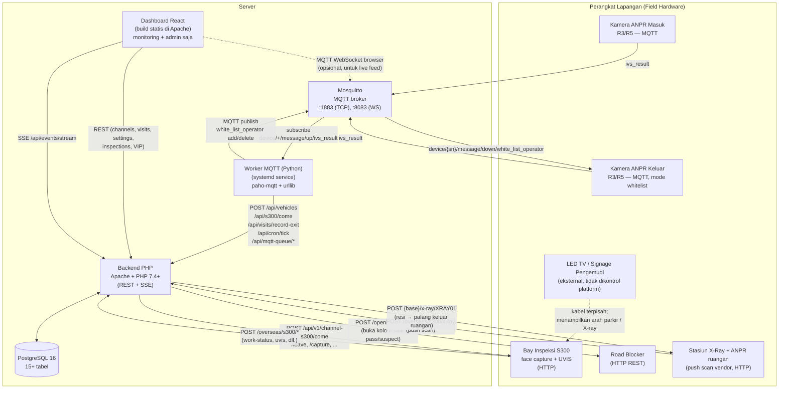
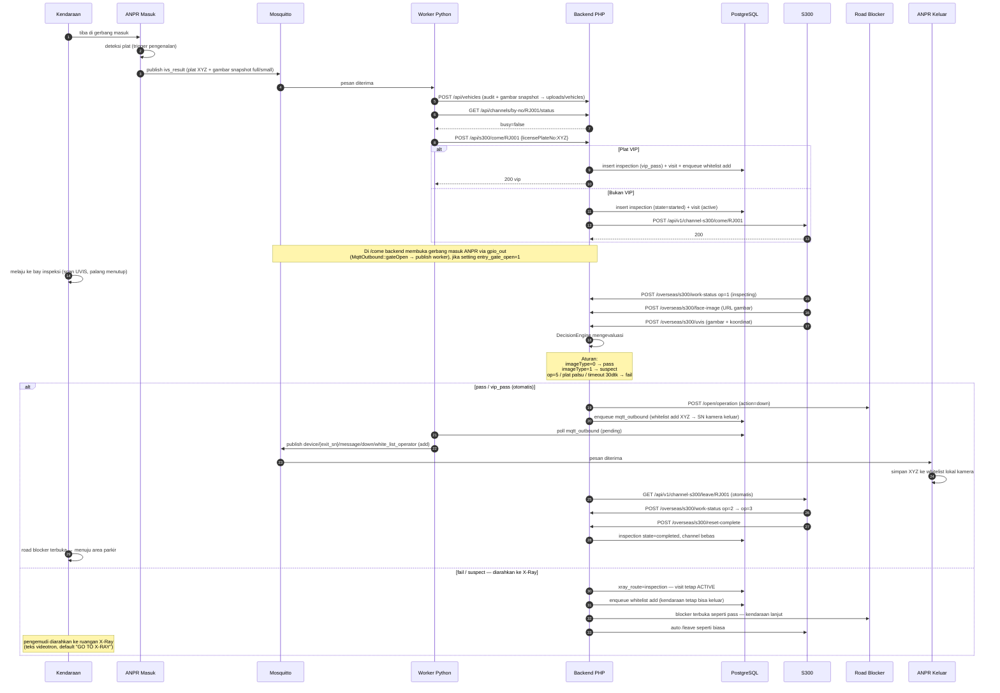
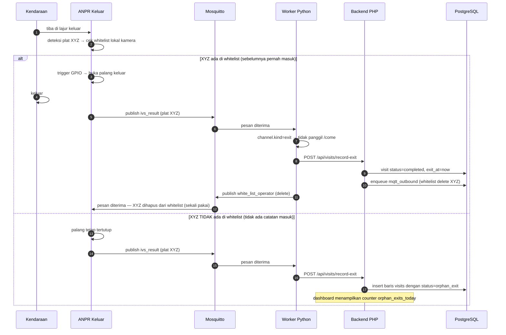
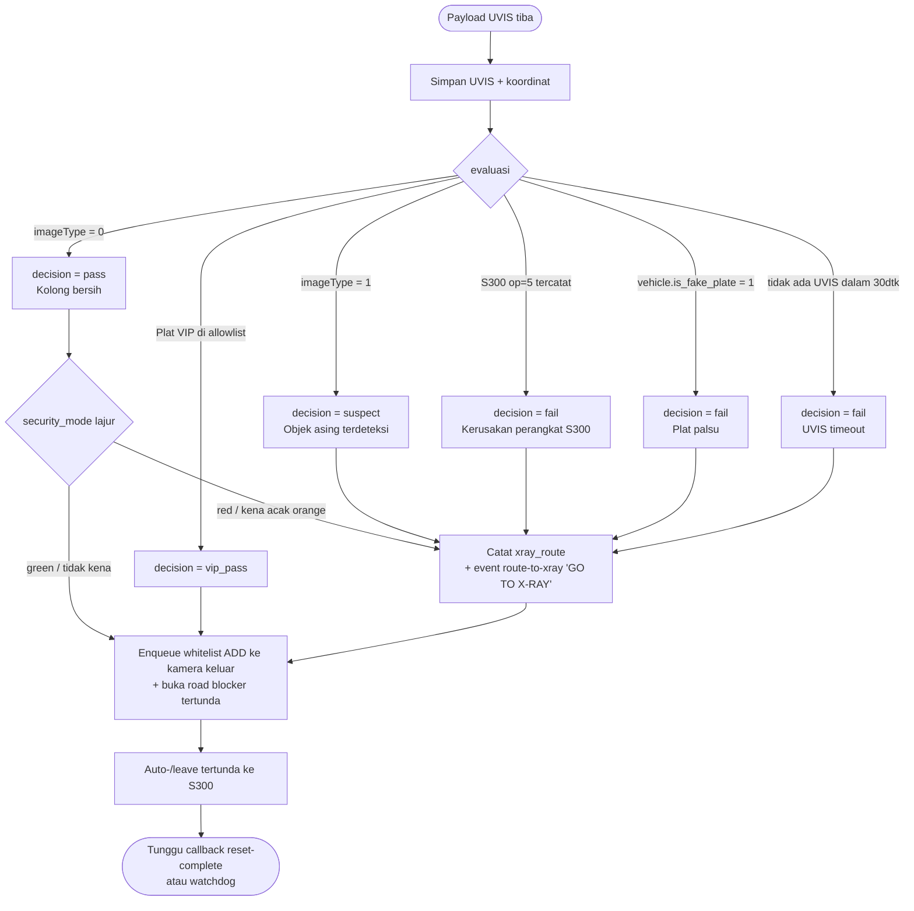
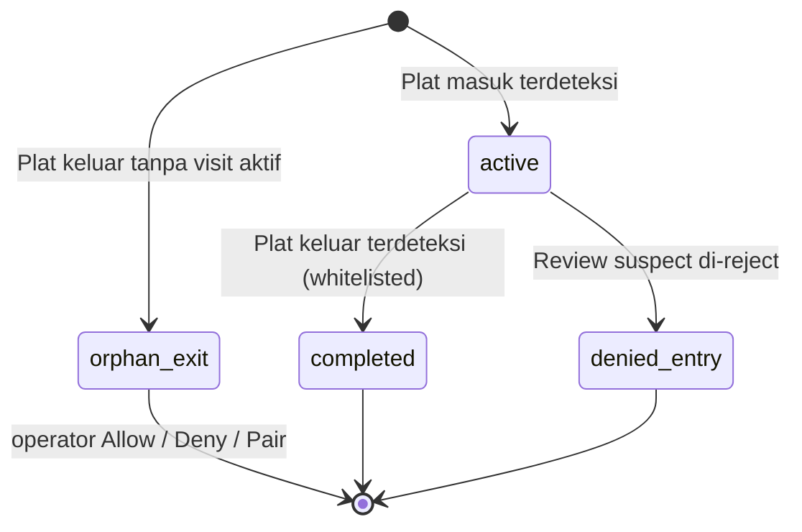

# Arsitektur Sistem — Platform ANPR + S300

> Diagram menggunakan [Mermaid](https://mermaid.js.org/) — otomatis ter-render di GitHub
> dan di VS Code dengan extension "Markdown Preview Mermaid Support".

## 1. Gambaran Komponen


```mermaid
graph TB
  subgraph "Perangkat Lapangan (Field Hardware)"
    EntryANPR["Kamera ANPR Masuk<br/>R3/R5 — MQTT"]
    ExitANPR["Kamera ANPR Keluar<br/>R3/R5 — MQTT, mode whitelist"]
    S300["Bay Inspeksi S300<br/>face capture + UVIS<br/>(HTTP)"]
    RoadBlocker["Road Blocker<br/>(HTTP REST)"]
    XrayStation["Stasiun X-Ray + ANPR ruangan<br/>(push scan vendor, HTTP)"]
    LedTv["LED TV / Signage Pengemudi<br/>(eksternal, tidak dikontrol platform)"]
  end

  subgraph "Server"
    Mosquitto["Mosquitto<br/>MQTT broker<br/>:1883 (TCP), :8083 (WS)"]
    Worker["Worker MQTT (Python)<br/>(systemd service)<br/>paho-mqtt + urllib"]
    Backend["Backend PHP<br/>Apache + PHP 7.4+<br/>(REST + SSE)"]
    PostgreSQL[("PostgreSQL 16<br/>15+ tabel")]
    Frontend["Dashboard React<br/>(build statis di Apache)<br/>monitoring + admin saja"]
  end

  EntryANPR -- "ivs_result" --> Mosquitto
  ExitANPR -- "ivs_result" --> Mosquitto
  Mosquitto -- "subscribe<br/>device/+/message/up/ivs_result" --> Worker
  Worker -- "POST /api/vehicles<br/>/api/s300/come<br/>/api/visits/record-exit<br/>/api/cron/tick<br/>/api/mqtt-queue/*" --> Backend

  Backend -- "POST /api/v1/channel-s300/come<br/>/leave, /capture, ..." --> S300
  S300 -- "POST /overseas/s300/*<br/>(work-status, uvis, dll.)" --> Backend

  Backend -- "POST /open/operation<br/>(buka kolom saat pass/suspect)" --> RoadBlocker

  XrayStation -- "POST /overseas/s300/x-ray<br/>(push scan)" --> Backend
  Backend -- "POST {base}/x-ray/XRAY01<br/>(resi → palang keluar ruangan)" --> XrayStation

  Worker -- "MQTT publish<br/>white_list_operator add/delete" --> Mosquitto
  Mosquitto -- "device/{sn}/message/down/white_list_operator" --> ExitANPR

  Backend <--> PostgreSQL

  Frontend -- "REST (channels, visits, settings,<br/>inspections, VIP)" --> Backend
  Frontend -- "SSE /api/events/stream" --> Backend
  Frontend -. "MQTT WebSocket browser<br/>(opsional, untuk live feed)" .-> Mosquitto

  LedTv -. "kabel terpisah;<br/>menampilkan arah parkir / X-ray" .-> S300
```

## 2. Komponen — Ringkasan

| Komponen | Fungsi | Teknologi | Kritis untuk runtime? |
|---|---|---|---|
| **Mosquitto** | MQTT broker, jembatan antara kamera dan worker | C broker, native | **Ya** — tanpa ini tidak ada plat masuk |
| **Worker Python** | Satu-satunya pemicu otomasi: subscribe MQTT, drive REST, publish MQTT keluar | Python 3.10+, paho-mqtt | **Ya** — tanpa ini tidak ada otomasi |
| **Backend PHP** | REST API, decision engine, panggilan road blocker, callback S300 | PHP 7.4+ dengan `pdo_pgsql`, Apache, vanilla (tanpa Composer) | **Ya** — semua aksi lewat sini |
| **PostgreSQL** | Status: channels, inspections, visits, VIP, antrian, log | PostgreSQL 13+ (16 direkomendasikan; Docker atau native) | **Ya** |
| **Dashboard React** | Monitoring + admin (channels, VIP, settings, laporan) | React 19 + Vite + Tailwind 4 | **Tidak** — sistem berjalan headless |

## 3. Alur Kendaraan Masuk — Sequence End-to-End


```mermaid
sequenceDiagram
  autonumber
  participant V as Kendaraan
  participant E as ANPR Masuk
  participant M as Mosquitto
  participant W as Worker Python
  participant B as Backend PHP
  participant DB as PostgreSQL
  participant S as S300
  participant RB as Road Blocker
  participant X as ANPR Keluar

  V->>E: tiba di gerbang masuk
  E->>E: deteksi plat (trigger pengenalan)
  E->>M: publish ivs_result (plat XYZ + gambar snapshot full/small)
  M->>W: pesan diterima
  W->>B: POST /api/vehicles (audit + gambar snapshot → uploads/vehicles)
  W->>B: GET /api/channels/by-no/RJ001/status
  B-->>W: busy=false
  W->>B: POST /api/s300/come/RJ001 {licensePlateNo:XYZ}

  alt Plat VIP
    B->>DB: insert inspection (vip_pass) + visit + enqueue whitelist add
    B-->>W: 200 vip
  else Bukan VIP
    B->>DB: insert inspection (state=started) + visit (active)
    B->>S: POST /api/v1/channel-s300/come/RJ001
    S-->>B: 200
  end

  Note over B,M: Di /come backend membuka gerbang masuk ANPR via gpio_out<br/>(MqttOutbound::gateOpen → publish worker), jika setting entry_gate_open=1

  V->>V: melaju ke bay inspeksi (scan UVIS, palang menutup)
  S->>B: POST /overseas/s300/work-status op=1 (inspecting)
  S->>B: POST /overseas/s300/face-image (URL gambar)
  S->>B: POST /overseas/s300/uvis (gambar + koordinat)
  B->>B: DecisionEngine mengevaluasi
  Note over B: Aturan:<br/>imageType=0 → pass<br/>imageType=1 → suspect<br/>op=5 / plat palsu / timeout 30dtk → fail

  alt pass / vip_pass (otomatis)
    B->>RB: POST /open/operation (action=down)
    B->>DB: enqueue mqtt_outbound (whitelist add XYZ → SN kamera keluar)
    W->>DB: poll mqtt_outbound (pending)
    W->>M: publish device/{exit_sn}/message/down/white_list_operator (add)
    M->>X: pesan diterima
    X->>X: simpan XYZ ke whitelist lokal kamera
    B->>S: GET /api/v1/channel-s300/leave/RJ001 (otomatis)
    S->>B: POST /overseas/s300/work-status op=2 → op=3
    S->>B: POST /overseas/s300/reset-complete
    B->>DB: inspection state=completed, channel bebas
    V->>V: road blocker terbuka → menuju area parkir
  else fail / suspect — diarahkan ke X-Ray
    B->>DB: xray_route=inspection — visit tetap ACTIVE
    B->>DB: enqueue whitelist add (kendaraan tetap bisa keluar)
    B->>RB: blocker terbuka seperti pass — kendaraan lanjut
    B->>S: auto /leave seperti biasa
    Note over V: pengemudi diarahkan ke ruangan X-Ray<br/>(teks videotron, default "GO TO X-RAY")
  end
```

## 4. Alur Kendaraan Keluar — Sequence End-to-End


```mermaid
sequenceDiagram
  autonumber
  participant V as Kendaraan
  participant X as ANPR Keluar
  participant M as Mosquitto
  participant W as Worker Python
  participant B as Backend PHP
  participant DB as PostgreSQL

  V->>X: tiba di lajur keluar
  X->>X: deteksi plat XYZ → cek whitelist lokal kamera

  alt XYZ ada di whitelist (sebelumnya pernah masuk)
    X->>X: trigger GPIO → buka palang keluar
    V->>V: keluar
    X->>M: publish ivs_result (plat XYZ)
    M->>W: pesan diterima
    W->>W: channel.kind=exit → tidak panggil /come
    W->>B: POST /api/visits/record-exit
    B->>DB: visit status=completed, exit_at=now
    B->>DB: enqueue mqtt_outbound (whitelist delete XYZ)
    W->>M: publish white_list_operator (delete)
    M->>X: pesan diterima — XYZ dihapus dari whitelist (sekali pakai)
  else XYZ TIDAK ada di whitelist (tidak ada catatan masuk)
    X->>X: palang tetap tertutup
    X->>M: publish ivs_result (plat XYZ)
    M->>W: pesan diterima
    W->>B: POST /api/visits/record-exit
    B->>DB: insert baris visits dengan status=orphan_exit
    Note over B: dashboard menampilkan counter orphan_exits_today
  end
```

## 5. Logika Keputusan (Decision Logic)


```mermaid
flowchart TD
  start([Payload UVIS tiba]) --> uvisSaved[Simpan UVIS + koordinat]
  uvisSaved --> evalDec{evaluasi}
  evalDec -->|Plat VIP di allowlist| vipPass[decision = vip_pass]
  evalDec -->|S300 op=5 tercatat| eqFail[decision = fail<br/>Kerusakan perangkat S300]
  evalDec -->|vehicle.is_fake_plate = 1| fakeFail[decision = fail<br/>Plat palsu]
  evalDec -->|imageType = 0| pass[decision = pass<br/>Kolong bersih]
  evalDec -->|imageType = 1| suspect[decision = suspect<br/>Objek asing terdeteksi]
  evalDec -->|tidak ada UVIS dalam 30dtk| timeoutFail[decision = fail<br/>UVIS timeout]

  pass --> secCheck{security_mode lajur}
  secCheck -->|red / kena acak orange| xrayRoute
  secCheck -->|green / tidak kena| action1
  vipPass --> action1
  suspect --> xrayRoute
  eqFail --> xrayRoute
  fakeFail --> xrayRoute
  timeoutFail --> xrayRoute
  xrayRoute[Catat xray_route<br/>+ event route-to-xray 'GO TO X-RAY'] --> action1

  action1[Enqueue whitelist ADD ke kamera keluar<br/>+ buka road blocker tertunda] --> autoLeave
  autoLeave[Auto-/leave tertunda ke S300] --> finish([Tunggu callback reset-complete<br/>atau watchdog])
```

> **FAIL / SUSPECT tidak lagi disuruh mundur.** Mundur melawan antrean di
> belakang kendaraan menimbulkan kemacetan total, jadi setiap verdict membiarkan
> kendaraan lanjut: kamera keluar di-whitelist, road blocker terbuka seperti pass
> (tertunda, agar S300 menyelesaikan scan-nya dulu), dan fail/suspect
> **diarahkan ke X-Ray** untuk pemeriksaan lanjutan (`xray_route = 'inspection'`)
> — lihat §6. Visit tetap ACTIVE. Jalur audio-mundur + `denied_entry` sekarang
> hanya berjalan saat operator me-**Reject** inspeksi yang masih ditahan untuk
> review manual (`review_status = pending`, tombol Approve/Reject —
> `review_approve` / `review_reject` di operation log). **Gerbang masuk ANPR**
> yang terpisah (`gpio_out`) terbuka lebih awal, di `/come`, apa pun verdict-nya.

## 6. Screening X-Ray & Perutean

### 6.1 Alur resi (push scan → resi palang)

Stasiun x-ray mem-push setiap scan ke `POST /overseas/s300/x-ray`. Push ini
**tanpa `channelNo`** — di-link ke inspeksi terbaru berdasarkan plat nomor dalam
rentang `xray_clearance_window_s` (default 3600 dtk); plat yang lebih lama atau
tidak dikenal disimpan sebagai scan berdiri sendiri. Push ulang dengan `SN` yang
sudah tercatat (id unik scan) diabaikan (pengaman retry vendor).

- **Scan bersih** (`IsAnomaly=false`) — saat `xray_auto_receipt=1` (default)
  backend langsung mengirim resi vendor `POST {base}/x-ray/{channelNo}` dengan
  `Result:true` → **palang keluar ruangan terbuka** (`review_status='auto'`).
- **Anomali** — resi tidak dikirim; scan tetap `pending` untuk direview operator
  di **tab X-Ray** (pass/deny). Deny mengirim `Result:false` — palang tetap
  tertutup. Resi yang gagal terkirim bisa diulang via `POST /api/xray/{id}/resend`.

Resi selalu ditujukan ke channel vendor milik stasiun x-ray sendiri — setting
`xray_channel_no` (default `XRAY01`).

### 6.2 Loop ruangan X-Ray

Channel kind `'xray'` menandai **kamera ANPR milik ruangan itu sendiri**. Plat
apa pun yang dikenali (diarahkan maupun sukarela) membuka gerbang **MASUK**
ruangan: worker memanggil `POST /api/xray/room-come/{channelNo}`, yang meng-queue
pulsa `gpio_out`. Gerbang **KELUAR** ruangan digerakkan vendor lewat resi di
atas — platform tidak pernah membukanya.

Setelah scan **PASSED**, kendaraan kembali ke lajur masuk mana pun dan diterima
**tanpa inspeksi** selama masih di dalam clearance window (catatan inspeksi
"X-ray cleared" ditulis). Scan **DENIED** yang masuk kembali juga diterima —
kendaraan yang di-deny hanya bergerak dengan keterlibatan operator — tapi
entri itu **DI-FLAG** (op-log `come_xray_flagged`). Pengecekan clearance ini
berjalan **sebelum** cek blacklist dan security mode; kalau tidak, mobil
blacklist atau dari lajur red yang kembali dari ruangan x-ray akan diarahkan ke
sana lagi selamanya.

### 6.3 Security mode per lajur

`anprc_channels.security_mode` menentukan kendaraan BERSIH mana yang diarahkan
ke x-ray setelah inspeksi:

| Mode | Perilaku |
|---|---|
| `red` | setiap kendaraan diarahkan ke x-ray |
| `orange` | `security_random_pct` % kendaraan bersih diarahkan secara acak (yang tidak bersih selalu diarahkan) |
| `green` (default) | hanya fail/suspect yang diarahkan |

Bypass VIP dikecualikan by design. Operator juga bisa mengarahkan inspeksi mana
pun secara manual (tombol "Route to X-Ray" → `POST /api/inspections/{id}/route-xray`).
`anprc_inspections.xray_route` mencatat alasan kendaraan dikirim:
`inspection | security_red | security_random | manual | blacklist | whitelist_only`.

### 6.4 Lajur blacklist & whitelist-only

Plat **blacklist** **tidak ditolak**. Inspeksi S300 dilewati (decision `pass`,
catatan "Blacklisted vehicle"), gerbang ANPR terbuka, kamera menyuarakan
"Blacklisted Vehicle. Go To X-RAY", dan kendaraan langsung diarahkan ke x-ray
(`xray_route='blacklist'`). Blacklist menang atas VIP, dan hanya berlaku di
lajur dengan `behavior_blacklist=1`.

Lajur dengan `behavior_whitelist_only=1` menerima plat yang ter-allowlist secara
normal; plat lainnya masuk dengan cara yang sama — inspeksi dilewati, gerbang
terbuka, suara "Unregistered Vehicle. Go To X-RAY", diarahkan ke x-ray
(`xray_route='whitelist_only'`).

## 7. State Machine Visit


```mermaid
stateDiagram-v2
  [*] --> active: Plat masuk terdeteksi
  active --> completed: Plat keluar terdeteksi (whitelisted)
  active --> denied_entry: Review suspect di-reject
  [*] --> orphan_exit: Plat keluar tanpa visit aktif
  orphan_exit --> [*]: operator Allow / Deny / Pair
  completed --> [*]
  denied_entry --> [*]
```

- **Entry adalah upsert** — `createEntry` memakai ulang/menyegarkan satu visit
  aktif milik plat itu jika ia sudah di dalam (re-entry loop x-ray, exit yang
  terlewat, pengenalan ganda; catatan "Re-entry while active" direkam). Satu
  plat tidak pernah tercatat di dalam dua kali, dan re-entry sendiri tidak
  pernah diblokir.
- **Orphan exit butuh konfirmasi** — pengenalan kamera keluar tanpa visit aktif
  tidak lagi lolos otomatis. Barisnya disimpan dengan `orphan_review='pending'`
  dan popup CP (di semua halaman) mewajibkan operator memilih **Allow** (buka
  palang keluar), **Deny** (palang tetap tertutup), atau **Pair** — memasangkan
  salah-baca itu dengan visit aktif berplat mirip: visit tersebut ditutup
  sebagai exit normal, palang dibuka, dan baris orphan dihapus agar total
  masuk/keluar/di-dalam tetap klop.
- **Overstay** — dashboard menghitung visit aktif yang lebih tua dari 24 jam
  sebagai overstay (status saja; tidak ada penindakan).

## 8. Inspection `state` vs S300 `operating_state`

Dua kolom berbeda dengan siklus berbeda — pemisahan ini memperbaiki race
condition yang dulu menyebabkan phantom completion:

```
Platform `state`                  S300 `current_operating_state`
─────────────────                 ──────────────────────────────
pending  (dialokasikan, /come belum)
started  (/come terkirim)
inspecting  ← op=1                0  (Ready — di antara kendaraan)
resetting   (setelah /leave)      1  (Inspecting)
completed   (reset-complete)      2  (Resetting)
emergency_stop                    3  (Reset complete)
failed                            4  (Emergency stop)
vip_skipped                       5  (Equipment failure)
denied_entry  (decision=fail)     6  (Self-test)
```

- `state` digerakkan oleh **event platform**: `/come`, `/leave`, callback `reset-complete`.
- `current_operating_state` hanya **cerminan** push work-status terakhir.
- Work-status sendirian **tidak** mengubah `state` (kecuali untuk kegagalan terminal op=4 / op=5).

## 9. Skema Database (level tinggi)

| Tabel | Tujuan |
|---|---|
| `anprc_channels` | Satu baris per lajur / gerbang (`kind` entry, exit, atau xray). Saklar perilaku per lajur (`behavior_blacklist`, `behavior_vip`, `behavior_whitelist_only`, `behavior_uvis_s300`) + `security_mode` (red/orange/green) dengan `security_random_pct` |
| `anprc_vehicles` | Audit log setiap deteksi plat ANPR (masuk dan keluar). `full_image_path` / `small_image_path` = snapshot `ivs_result` tersimpan (scene penuh + close-up plat; file di `uploads/vehicles/`, DB hanya menyimpan path) |
| `anprc_visits` | Satu baris per siklus "masuk → keluar". Status: active, completed, orphan_exit, denied_entry. `orphan_review` (pending/allowed/denied) + `orphan_reviewed_by/_at` melacak konfirmasi orphan-exit |
| `anprc_inspections` | Satu baris per siklus inspeksi S300. `xray_route` mencatat alasan kendaraan dikirim ke x-ray; `review_status` + `reviewed_by` + `reviewed_at` melacak review manual sebuah SUSPECT |
| `anprc_inspection_status_logs` | Setiap push work-status dari S300 |
| `anprc_inspection_face_images` | URL foto wajah |
| `anprc_inspection_video_streams` | Alamat stream RTSP untuk 6 kamera lengan robot |
| `anprc_inspection_uvis` + `_coords` | Gambar scan kolong + bounding box objek asing |
| `anprc_inspection_xray` + `_alarms` | Scan x-ray yang di-push stasiun, di-link ke inspeksi berdasarkan plat. `review_status` (pending/auto/passed/denied) + kolom resi (`receipt_result/_status/_error/_sent_at`) menggerakkan alur resi (§6.1) |
| `anprc_vip_plates` | Allowlist plat yang lewati inspeksi S300. `expires_at` opsional (NULL = permanen; entri kedaluwarsa berhenti cocok tapi tetap terlihat) |
| `anprc_blacklist_plates` | Plat blacklist — inspeksi dilewati + diarahkan ke x-ray (§6.4). `expires_at` opsional, semantik sama dengan VIP |
| `anprc_audio_prompts` | Audio kustom yang dipush ke S300 |
| `anprc_users` | Akun operator |
| `anprc_operation_log` | Audit trail setiap aksi backend |
| `anprc_settings` | Setting key-value sistem (`auto_start_s300`, `auto_start_channel`, `blocker_close_mode`, gerbang ANPR `entry_gate_open`/`entry_gate_io`/`entry_gate_value`/`entry_gate_pulse_ms`, x-ray `xray_channel_no`/`xray_base_url`/`xray_auto_receipt`/`xray_clearance_window_s`, heartbeat `worker_last_seen_at`) |
| `anprc_inbound_events_raw` | Callback S300 mentah (untuk debugging/replay) |
| `anprc_mqtt_outbound_queue` | Perintah MQTT pending yang harus dipublish worker |

## 10. Permukaan API (Backend PHP)

### Inbound (S300 memanggil platform di endpoint ini)
- `POST /overseas/s300/work-status` — update operatingState (cmdNo 322)
- `POST /overseas/s300/face-image` — URL foto wajah (cmdNo 323)
- `POST /overseas/s300/video-record` — RTSP 6 kamera (cmdNo 325)
- `POST /overseas/s300/uvis` — scan kolong (memicu keputusan)
- `POST /overseas/s300/reset-complete` — peralatan selesai reset (cmdNo 326)
- `POST /overseas/s300/x-ray` — push scan X-ray (tanpa channelNo; di-link berdasarkan plat — lihat §6.1)

### Outbound (platform → S300, via proxy backend)
- `POST /api/s300/come/{channelNo}` — mulai inspeksi
- `GET  /api/s300/capture/{channelNo}` — ambil ulang snapshot
- `GET  /api/s300/leave/{channelNo}` — selesaikan inspeksi
- `POST /api/s300/read-work-status/{channelNo}`
- `POST /api/s300/emergency-stop/{channelNo}`
- `POST /api/s300/manual-reset/{channelNo}`
- `POST {base}/x-ray/{channelNo}` — resi pass/fail X-ray (dikirim `XrayService`, bukan route)
- `POST /api/s300/audio-prompt` — set audio kustom
- `POST /api/s300/video-playback` — ambil RTSP untuk rentang waktu

### Internal (dashboard + worker)
- `GET/POST/PUT/DELETE /api/channels` + `/api/channels/by-no/{ch}/status`
- `GET /api/inspections`, `GET /api/inspections/{id}`
- `POST /api/inspections/{id}/approve` / `/reject` — menyelesaikan review SUSPECT yang ditahan
- `POST /api/inspections/{id}/route-xray` — "Route to X-Ray" manual
- `GET /api/xray`, `POST /api/xray/{id}/review`, `POST /api/xray/{id}/resend` — tab X-Ray (daftar scan + pass/deny operator + ulang resi)
- `POST /api/xray/room-come/{channelNo}` — ANPR ruangan x-ray → buka gerbang masuk ruangan (worker)
- `GET/POST /api/vehicles`
- `GET/POST /api/visits`, `GET /api/visits/summary`, `POST /api/visits/record-exit`
- `POST /api/visits/{id}/orphan-allow` / `/orphan-deny`, `GET /api/visits/{id}/orphan-candidates`, `POST /api/visits/{id}/orphan-pair` — konfirmasi orphan-exit (§7)
- `GET/POST/PUT/DELETE /api/vip` (dan padanan blacklist-nya)
- `GET/PUT /api/settings`
- `GET /api/operation-log` — jejak audit (bisa difilter actor/action/status/tanggal/cari)
- `GET /api/operation-log/facets` — daftar actor + action unik untuk dropdown filter
- `GET /api/events/stream` — Server-Sent Events untuk update UI realtime
- `POST /api/cron/tick` — sweep timeout UVIS + watchdog reset
- `GET /api/mqtt-queue/pending`, `POST /api/mqtt-queue/{id}/sent`, `POST /api/mqtt-queue/{id}/failed`
- `POST /api/auth/sso`, `GET /api/auth/me` — login SSO (lihat [`DEV_LOGIN.id.md`](./DEV_LOGIN.id.md))

## 11. Topik MQTT

| Topik | Arah | Tujuan |
|---|---|---|
| `device/{sn}/message/up/ivs_result` | kamera → platform | Pengenalan plat |
| `device/{sn}/message/up/keep_alive` | kamera → platform | Heartbeat |
| `device/{sn}/message/up/gpio_in` | kamera → platform | Event input IO |
| `device/{sn}/message/up/barr_gate_status` | kamera → platform | Status palang |
| `device/{sn}/message/down/white_list_operator` | platform → kamera | Tambah/hapus plat dari whitelist |
| `device/{sn}/message/down/{cmd}` | platform → kamera | Perintah lain (`ivs_trigger`, `gpio_out`, `serial_data`, dll.) |
| `device/{sn}/message/down/{cmd}/reply` | kamera → platform | Ack untuk di atas |

## 12. Tipe Event Live (SSE)

Frontend subscribe ke `/api/events/stream`. Setiap event punya field `type`:

- `work-status`, `face-image`, `video-record`, `reset-complete`, `uvis`, `x-ray` — callback S300 / stasiun x-ray
- `decision` — DecisionEngine menghasilkan vonis
- `blocker-opened` — panggilan road blocker sukses
- `failure-audio-sent` — audio mundur dikirim saat review di-reject
- `vip-bypass` — plat VIP melewati inspeksi
- `route-to-xray` — kendaraan diarahkan ke x-ray (inspeksi / security mode / manual)
- `blacklist-xray`, `whitelist-xray` — entri blacklist / whitelist-only diarahkan ke x-ray
- `x-ray-receipt` — resi vendor terkirim (otomatis atau setelah review)
- `xray-cleared`, `xray-flagged` — re-entry clearance diterima (flagged = scan-nya di-deny)
- `xray-room-come` — buka gerbang ruangan x-ray di-queue
- `review-resolved` — review suspect di-approve/reject
- `visit-completed`, `orphan-exit`, `orphan-review` — event keluar
- `reset-watchdog` — reset macet dipaksa selesai

## 13. Ringkasan Mode Kegagalan

| Apa yang rusak | Efek | Pemulihan |
|---|---|---|
| MQTT broker mati | Tidak ada plat mengalir; kamera retry koneksi | Restart `mosquitto` |
| Worker Python mati | Plat menumpuk di MQTT (broker retain sebentar) tapi tidak ada yang memicu /come atau memproses keluar | `systemctl restart anpr-mqtt-worker` |
| Backend PHP / Apache mati | HTTP call worker gagal dan retry (terlihat di journal); callback S300 404 → S300 retry | Restart Apache |
| PostgreSQL mati | Backend return 500; worker log warning | Restart PostgreSQL |
| S300 tidak terjangkau di tengah inspeksi | UVIS tidak pernah tiba → timeout 30dtk → decision=fail → coba kirim audio mundur (juga gagal) → coba auto-leave (gagal) → 30dtk kemudian watchdog memaksa selesaikan inspeksi → channel bebas | Otomatis lewat cron tick |
| Road blocker tidak terjangkau | Keputusan tetap dibuat; aksi `open_blocker` di-log sebagai gagal; kendaraan terjebak — perlu alert operator | Manual: dashboard "Emergency Stop" + intervensi fisik |
| Mismatch whitelist kamera keluar | Kendaraan terjebak di pintu keluar | Pakai log worker + halaman Visits untuk cari plat; manual add lewat antrian MQTT di DB |

## 14. Tanggung jawab platform vs perangkat keras

Prinsip desain: **platform memegang pengambilan keputusan dan otorisasi** (apa yang
diizinkan, apa verdict-nya); **perangkat keras memegang gerakan fisik yang membawa risiko
keselamatan** (kapan aman untuk menggerakkan palang). Platform tidak pernah memerintahkan
gerakan yang keselamatannya bergantung pada keberadaan kendaraan secara real-time —
penilaian itu milik loop detector / controller perangkat itu sendiri.

### Aksi yang dimulai oleh PLATFORM (backend + worker)

| Aksi | Target | Jalur kode | Pemicu |
|---|---|---|---|
| Mulai inspeksi (`come`) | S300 | `S300Controller::come` | plat terdeteksi → worker → `/api/s300/come` |
| Capture / read-work-status | S300 | `S300Controller` | alur inspeksi |
| Leave / auto-leave | S300 | `DecisionExecutor::autoLeave` | setelah setiap keputusan |
| Emergency stop, manual reset | S300 | `S300Controller` | aksi manual operator |
| Audio prompt / audio mundur saat FAIL | S300 | `DecisionExecutor::sendBackUpAudio` | alur / verdict FAIL |
| **Road blocker TURUN** (buka, `down`) | Road blocker | `DecisionExecutor::openBlocker` | setiap verdict (tertunda; hanya lajur auto-open — fail/suspect lanjut ke x-ray) |
| Road blocker NAIK (tutup, `up`) | Road blocker | `CronController::tick` | **hanya legacy `blocker_close_mode = backend_timer`** — mati secara default |
| Whitelist add / delete | Kamera ANPR keluar | `MqttOutbound` → publish MQTT worker | masuk PASS (add) / setelah keluar (delete) |
| Verdict pass/suspect/fail/vip | — (logika) | `DecisionEngine::evaluate` | hasil UVIS atau timeout |
| Sapuan timeout / reset watchdog | — (logika) | `CronController::tick` | worker tiap 5 dtk |
| Pembukuan visit, audit log, log MQTT | — (DB) | berbagai | event |

### Aksi yang dilakukan PERANGKAT KERAS sendiri (platform tidak terlibat)

| Aksi | Perangkat | Catatan |
|---|---|---|
| Menentukan *kapan* mengenali plat (loop detector / video trigger) | Kamera ANPR | `triggerType` di `ivs_result` |
| Mengirim `ivs_result`, `keep_alive`, `gpio_in`, `barr_gate_status` | Kamera ANPR | dikirim otonom; platform hanya log/konsumsi |
| **Membuka palang KELUAR saat cocok whitelist** (relay sendiri) | Kamera ANPR keluar | platform hanya pra-otorisasi plat via `white_list_operator` |
| **MENAIKKAN road blocker setelah kendaraan lewat** (tutup sendiri) | Controller road blocker | default `blocker_close_mode = hardware`; loop detector yang memutuskan |
| Interlock anti-himpit (menolak naik saat ada kendaraan) | Controller road blocker | ada di lapisan 485/controller — tidak diekspos via REST API-nya |
| Menutup palang masuk/keluar (loop / timer) | Controller gerbang | logika controller sendiri |
| Menjalankan siklus inspeksi penuh (gerak lengan, scan UVIS, `operating_state` 0–6) | S300 | platform hanya bilang *mulai* dan *leave*; S300 mengurutkan sendiri dan mengirim callback |
| Reset fisik setelah `leave` → callback `reset-complete` | S300 | platform hanya punya fallback watchdog 30 dtk |

### Model mental per palang

- **Road blocker masuk** — platform MEMBUKA (hanya ia tahu verdict); perangkat keras MENUTUP (keselamatan).
- **Palang keluar** — perangkat keras MEMBUKA (cocok whitelist) dan MENUTUP (loop/timer); platform hanya pra-otorisasi.
- **S300** — platform bilang "mulai" dan "leave"; perangkat keras menjalankan seluruh siklus fisik di antaranya.

### Prasyarat deployment (wiring/konfigurasi — verifikasi sebelum go-live)

1. **Tutup-sendiri road blocker** hanya terjadi jika controller di-wiring/konfigurasi untuk
   naik otomatis via loop detector-nya (konfigurasi Qigong/485). Sampai itu dikonfirmasi,
   jalur tetap terbuka setelah lolos — atau sementara set
   `settings.blocker_close_mode = 'backend_timer'` (risiko himpit; lihat DEVICE_SETUP_CHECKLIST).
2. **Buka-otomatis palang keluar** mensyaratkan kamera keluar dalam mode **Whitelist**
   dengan relay-nya ter-wiring ke controller gerbang.
