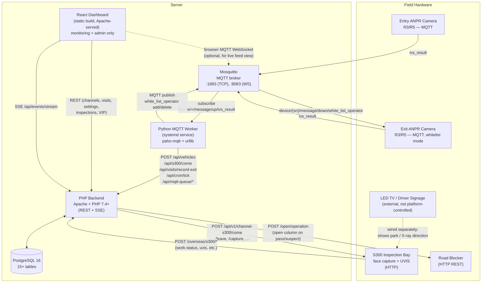
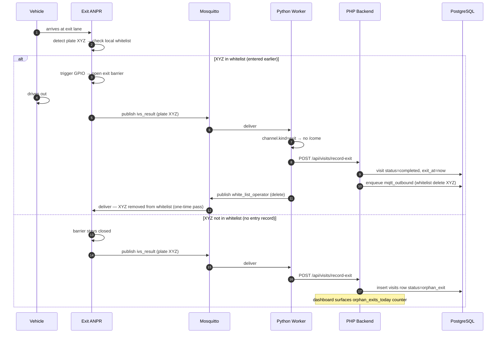
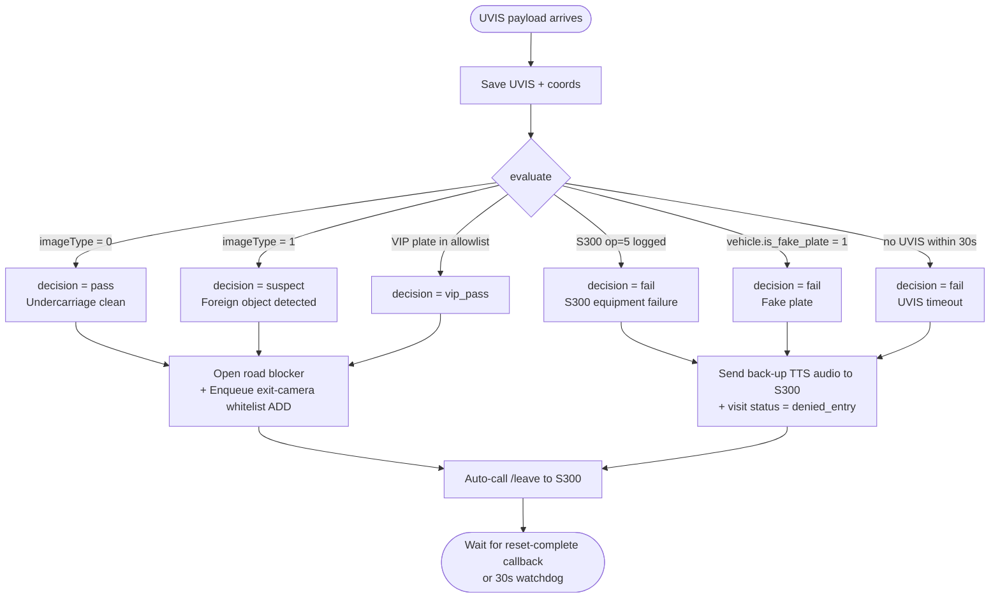
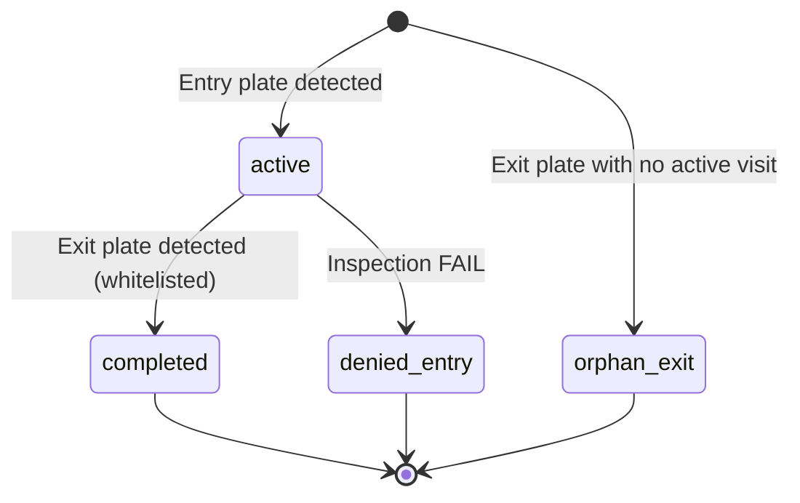

# ANPR + S300 Platform — System Architecture

> Diagrams use [Mermaid](https://mermaid.js.org/). They render automatically on GitHub
> and in VS Code with the "Markdown Preview Mermaid Support" extension installed.

## 1. Component overview



## 2. Components — at a glance

| Component | Role | Tech | Critical to runtime? |
|---|---|---|---|
| **Mosquitto** | MQTT broker, sits between cameras and worker | C broker, native | **Yes** — without it no plates flow |
| **Python Worker** | Sole trigger: subscribes to MQTT, drives REST calls, publishes outbound MQTT | Python 3.10+, paho-mqtt | **Yes** — without it no automation |
| **PHP Backend** | REST API, decision engine, road blocker calls, S300 callbacks | PHP 7.4+ with `pdo_pgsql`, Apache, vanilla (no Composer deps) | **Yes** — every action goes through it |
| **PostgreSQL** | State: channels, inspections, visits, VIP, queues, logs | PostgreSQL 13+ (16 recommended; Docker or native) | **Yes** |
| **React Dashboard** | Monitoring + admin (channels, VIP, settings, reports) | React 19 + Vite + Tailwind 4 | **No** — system runs headless |

## 3. Entry vehicle — end-to-end sequence

```mermaid
sequenceDiagram
  autonumber
  participant V as Vehicle
  participant E as Entry ANPR
  participant M as Mosquitto
  participant W as Python Worker
  participant B as PHP Backend
  participant DB as PostgreSQL
  participant S as S300
  participant RB as Road Blocker
  participant X as Exit ANPR

  V->>E: arrives at entry
  E->>E: detect plate, open entry barrier (local logic)
  E->>M: publish ivs_result (plate XYZ)
  M->>W: deliver
  W->>B: POST /api/vehicles (audit)
  W->>B: GET /api/channels/by-no/RJ001/status
  B-->>W: busy=false
  W->>B: POST /api/s300/come/RJ001 {licensePlateNo:XYZ}

  alt VIP plate
    B->>DB: insert inspection (vip_pass) + visit + enqueue whitelist add
    B-->>W: 200 vip
  else not VIP
    B->>DB: insert inspection (state=started) + visit (active)
    B->>S: POST /api/v1/channel-s300/come/RJ001
    S-->>B: 200
  end

  V->>V: drives onto inspection bay (UVIS scan, barrier closes)
  S->>B: POST /overseas/s300/work-status op=1 (inspecting)
  S->>B: POST /overseas/s300/face-image (URLs)
  S->>B: POST /overseas/s300/uvis (image + coords)
  B->>B: DecisionEngine evaluates
  Note over B: Rules:<br/>imageType=0 → pass<br/>imageType=1 → suspect<br/>op=5/fake/timeout30s → fail

  alt pass / suspect / vip
    B->>RB: POST /open/operation (action=down)
    B->>DB: enqueue mqtt_outbound (whitelist add XYZ → exit camera SN)
    W->>DB: poll mqtt_outbound (pending)
    W->>M: publish device/{exit_sn}/message/down/white_list_operator (add)
    M->>X: deliver
    X->>X: store XYZ in local whitelist
    B->>S: GET /api/v1/channel-s300/leave/RJ001 (auto)
    S->>B: POST /overseas/s300/work-status op=2 → op=3
    S->>B: POST /overseas/s300/reset-complete
    B->>DB: inspection state=completed, channel free
    V->>V: road blocker open → drives to parking
  else fail
    B->>S: POST audio-prompt (back-up message)
    B->>DB: visit status=denied_entry
    B->>S: GET /api/v1/channel-s300/leave (auto)
    Note over V: road blocker stays raised; vehicle backs out
  end
```

## 4. Exit vehicle — end-to-end sequence



## 5. Decision logic



## 6. Visit state machine



## 7. Inspection state vs. S300 operating_state

Two fields, two different lifecycles — keeping them separate fixes the race that
caused phantom completions:

```
Platform `state`              S300 `current_operating_state`
─────────────────             ──────────────────────────────
pending  (allocated, /come not called yet)
started  (/come sent)
inspecting  ← op=1            0  (Ready — between vehicles)
resetting   (after /leave)    1  (Inspecting)
completed   (reset-complete)  2  (Resetting)
emergency_stop                3  (Reset complete)
failed                        4  (Emergency stop)
vip_skipped                   5  (Equipment failure)
denied_entry  (decision=fail) 6  (Self-test)
```

- `state` is driven by **platform events**: `/come`, `/leave`, `reset-complete` callback.
- `current_operating_state` is just a **mirror** of the last work-status push.
- Work-status alone does **not** transition `state` (except for terminal failures op=4 / op=5).

## 8. Database schema (high level)

| Table | Purpose |
|---|---|
| `channels` | One row per lane / gate (entry or exit) — paired via `paired_channel_id` |
| `vehicles` | Audit log of every ANPR plate detection (entry and exit) |
| `visits` | One row per "entry → exit" cycle. Status: active, completed, orphan_exit, denied_entry |
| `inspections` | One row per S300 inspection lifecycle |
| `inspection_status_logs` | Every work-status push from S300 |
| `inspection_face_images` | Face capture URLs |
| `inspection_video_streams` | RTSP stream addresses for the 6 robot-arm cameras |
| `inspection_uvis` + `_coords` | Undercarriage scan images + foreign-object bounding boxes |
| `inspection_xray` + `_alarms` | X-ray inspection (received but not used in this deployment) |
| `vip_plates` | Whitelist of plates that skip S300 inspection |
| `audio_prompts` | Custom audio prompts pushed to S300 |
| `users` | Operator accounts |
| `operation_log` | Audit trail of every backend action |
| `settings` | Key-value system settings (`auto_start_s300`, `auto_start_channel`) |
| `inbound_events_raw` | Raw S300 callbacks (for debugging/replay) |
| `mqtt_outbound_queue` | Pending MQTT commands the worker should publish |

## 9. API surface (PHP backend)

### Inbound (S300 calls these on the platform)
- `POST /overseas/s300/work-status` — operatingState updates (cmdNo 322)
- `POST /overseas/s300/face-image` — face capture URLs (cmdNo 323)
- `POST /overseas/s300/video-record` — 6-camera RTSP (cmdNo 325)
- `POST /overseas/s300/uvis` — undercarriage scan (triggers decision)
- `POST /overseas/s300/reset-complete` — equipment reset done (cmdNo 326)
- `POST /overseas/s300/x-ray` — X-ray scan (logged, not used)

### Outbound (platform → S300, via backend proxy)
- `POST /api/s300/come/{channelNo}` — start inspection
- `GET  /api/s300/capture/{channelNo}` — retake snapshot
- `GET  /api/s300/leave/{channelNo}` — finish inspection
- `POST /api/s300/read-work-status/{channelNo}`
- `POST /api/s300/emergency-stop/{channelNo}`
- `POST /api/s300/manual-reset/{channelNo}`
- `POST /api/s300/x-ray/{channelNo}` — X-ray pass/fail receipt
- `POST /api/s300/audio-prompt` — set custom audio
- `POST /api/s300/video-playback` — fetch RTSP for time range

### Internal (dashboard + worker)
- `GET/POST/PUT/DELETE /api/channels` + `/api/channels/by-no/{ch}/status`
- `GET /api/inspections`, `GET /api/inspections/{id}`
- `GET/POST /api/vehicles`
- `GET/POST /api/visits`, `GET /api/visits/summary`, `POST /api/visits/record-exit`
- `GET/POST/PUT/DELETE /api/vip`
- `GET/PUT /api/settings`
- `GET /api/operation-log` — audit trail (filterable by actor/action/status/date/search)
- `GET /api/operation-log/facets` — distinct actors + actions for filter dropdowns
- `GET /api/events/stream` — Server-Sent Events for live UI updates
- `POST /api/cron/tick` — UVIS-timeout sweep + reset-watchdog
- `GET /api/mqtt-queue/pending`, `POST /api/mqtt-queue/{id}/sent`, `POST /api/mqtt-queue/{id}/failed`
- `POST /api/auth/sso`, `GET /api/auth/me` — SSO login (see [`DEV_LOGIN.md`](./DEV_LOGIN.md))

## 10. MQTT topics

| Topic | Direction | Purpose |
|---|---|---|
| `device/{sn}/message/up/ivs_result` | camera → platform | Plate recognition |
| `device/{sn}/message/up/keep_alive` | camera → platform | Heartbeat |
| `device/{sn}/message/up/gpio_in` | camera → platform | IO input event |
| `device/{sn}/message/up/barr_gate_status` | camera → platform | Barrier status |
| `device/{sn}/message/down/white_list_operator` | platform → camera | Add/remove whitelist plate |
| `device/{sn}/message/down/{cmd}` | platform → camera | Other commands (`ivs_trigger`, `gpio_out`, `gate_direct_open`, etc.) |
| `device/{sn}/message/down/{cmd}/reply` | camera → platform | Ack for the above |

## 11. Live event types (SSE)

Frontend subscribes to `/api/events/stream`. Each event has a `type` field:

- `work-status`, `face-image`, `video-record`, `reset-complete`, `uvis`, `x-ray` — S300 callbacks
- `decision` — DecisionEngine produced a verdict
- `blocker-opened` — road blocker call succeeded
- `failure-audio-sent` — back-up TTS sent on FAIL
- `vip-bypass` — VIP plate skipped inspection
- `visit-completed`, `orphan-exit` — exit events
- `reset-watchdog` — stuck reset force-completed

## 12. Failure-mode summary

| What breaks | Effect | Recovery |
|---|---|---|
| MQTT broker down | No plate flows; cameras retry their connection | Restart `mosquitto` |
| Python worker down | Plates pile up in MQTT (broker retains briefly) but nothing triggers /come or processes exits | `systemctl restart anpr-mqtt-worker` |
| PHP backend / Apache down | Worker HTTP calls fail and retry (visible in journal); S300 callbacks 404 → S300 retries | Restart Apache |
| PostgreSQL down | Backend returns 500; worker logs warnings | Restart PostgreSQL |
| S300 unreachable mid-inspection | UVIS never arrives → 30s timeout → decision=fail → back-up TTS attempted (also fails) → auto-leave attempt (fails) → watchdog 30s later force-completes the inspection → channel free | Automatic via cron tick |
| Road blocker unreachable | Decision still made; `open_blocker` action logged as failed; vehicle stuck — operator alert needed | Manual: dashboard "Emergency Stop" + physical intervention |
| Exit camera whitelist mismatch | Vehicles get stuck at exit | Use the worker logs + visits page to find the plate; manually add via MQTT command in DB queue |
