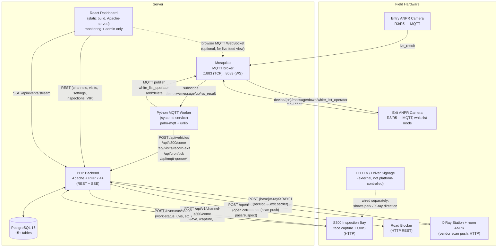
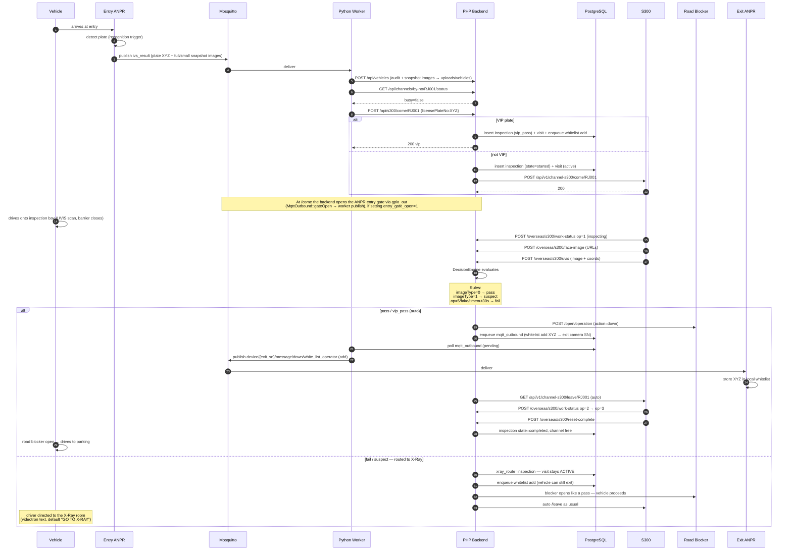
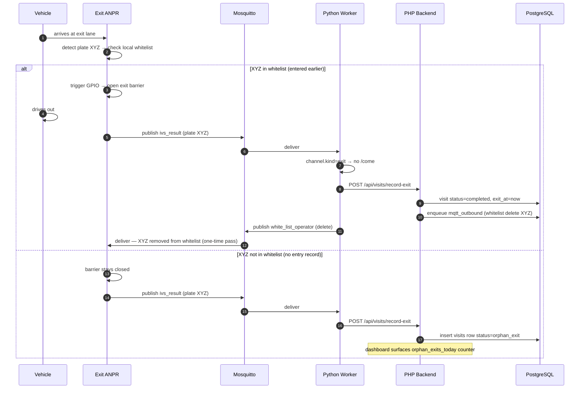
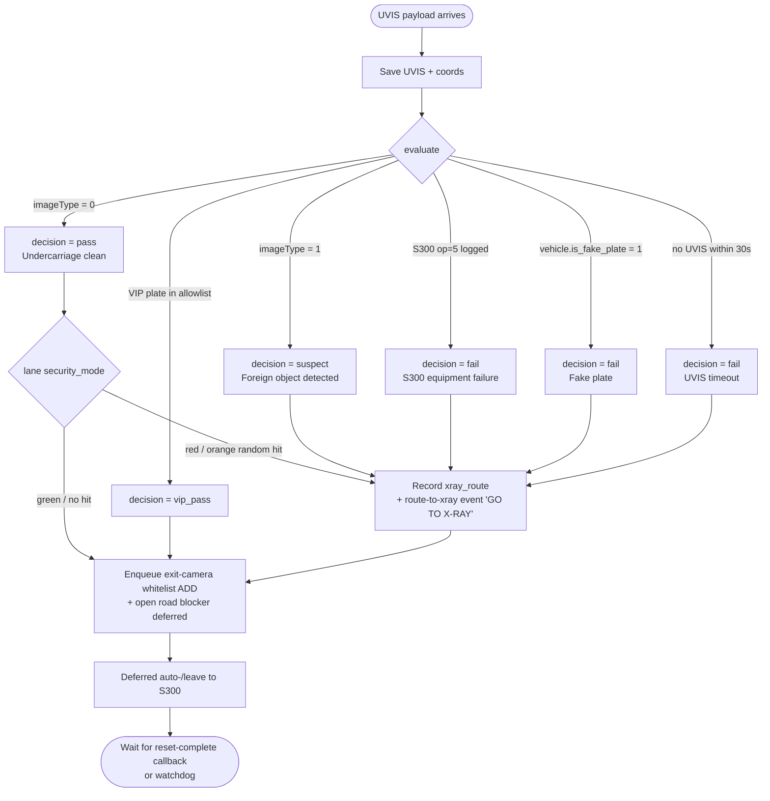
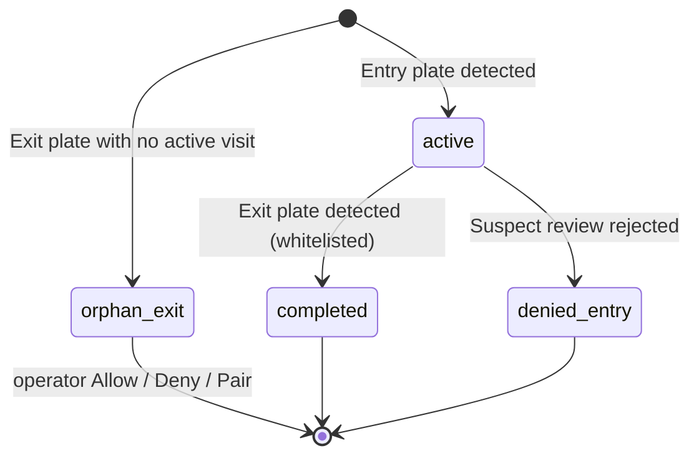

# ANPR + S300 Platform — System Architecture

> Diagrams use [Mermaid](https://mermaid.js.org/). They render automatically on GitHub
> and in VS Code with the "Markdown Preview Mermaid Support" extension installed.

## 1. Component overview


```mermaid
graph TB
  subgraph "Field Hardware"
    EntryANPR["Entry ANPR Camera<br/>R3/R5 — MQTT"]
    ExitANPR["Exit ANPR Camera<br/>R3/R5 — MQTT, whitelist mode"]
    S300["S300 Inspection Bay<br/>face capture + UVIS<br/>(HTTP)"]
    RoadBlocker["Road Blocker<br/>(HTTP REST)"]
    XrayStation["X-Ray Station + room ANPR<br/>(vendor scan push, HTTP)"]
    LedTv["LED TV / Driver Signage<br/>(external, not platform-controlled)"]
  end

  subgraph "Server"
    Mosquitto["Mosquitto<br/>MQTT broker<br/>:1883 (TCP), :8083 (WS)"]
    Worker["Python MQTT Worker<br/>(systemd service)<br/>paho-mqtt + urllib"]
    Backend["PHP Backend<br/>Apache + PHP 7.4+<br/>(REST + SSE)"]
    PostgreSQL[("PostgreSQL 16<br/>15+ tables")]
    Frontend["React Dashboard<br/>(static build, Apache-served)<br/>monitoring + admin only"]
  end

  EntryANPR -- "ivs_result" --> Mosquitto
  ExitANPR -- "ivs_result" --> Mosquitto
  Mosquitto -- "subscribe<br/>device/+/message/up/ivs_result" --> Worker
  Worker -- "POST /api/vehicles<br/>/api/s300/come<br/>/api/visits/record-exit<br/>/api/cron/tick<br/>/api/mqtt-queue/*" --> Backend

  Backend -- "POST /api/v1/channel-s300/come<br/>/leave, /capture, ..." --> S300
  S300 -- "POST /overseas/s300/*<br/>(work-status, uvis, etc.)" --> Backend

  Backend -- "POST /open/operation<br/>(open column on pass/suspect)" --> RoadBlocker

  XrayStation -- "POST /overseas/s300/x-ray<br/>(scan push)" --> Backend
  Backend -- "POST {base}/x-ray/XRAY01<br/>(receipt → exit barrier)" --> XrayStation

  Worker -- "MQTT publish<br/>white_list_operator add/delete" --> Mosquitto
  Mosquitto -- "device/{sn}/message/down/white_list_operator" --> ExitANPR

  Backend <--> PostgreSQL

  Frontend -- "REST (channels, visits, settings,<br/>inspections, VIP)" --> Backend
  Frontend -- "SSE /api/events/stream" --> Backend
  Frontend -. "browser MQTT WebSocket<br/>(optional, for live feed view)" .-> Mosquitto

  LedTv -. "wired separately;<br/>shows park / X-ray direction" .-> S300
```

## 2. Components — at a glance

| Component | Role | Tech | Critical to runtime? |
|---|---|---|---|
| **Mosquitto** | MQTT broker, sits between cameras and worker | C broker, native | **Yes** — without it no plates flow |
| **Python Worker** | Sole trigger: subscribes to MQTT, drives REST calls, publishes outbound MQTT | Python 3.10+, paho-mqtt | **Yes** — without it no automation |
| **PHP Backend** | REST API, decision engine, road blocker calls, S300 callbacks | PHP 7.4+ with `pdo_pgsql`, Apache, vanilla (no Composer deps) | **Yes** — every action goes through it |
| **PostgreSQL** | State: channels, inspections, visits, VIP, queues, logs | PostgreSQL 13+ (16 recommended; Docker or native) | **Yes** |
| **React Dashboard** | Monitoring + admin (channels, VIP, settings, reports) | React 19 + Vite + Tailwind 4 | **No** — system runs headless |

## 3. Entry vehicle — end-to-end sequence


```mermaid
sequenceDiagram
  autonumber
  participant V as Vehicle
  participant E as Entry ANPR
  participant M as Mosquitto
  participant W as Python Worker
  participant B as PHP Backend
  participant DB as PostgreSQL
  participant S as S300
  participant RB as Road Blocker
  participant X as Exit ANPR

  V->>E: arrives at entry
  E->>E: detect plate (recognition trigger)
  E->>M: publish ivs_result (plate XYZ + full/small snapshot images)
  M->>W: deliver
  W->>B: POST /api/vehicles (audit + snapshot images → uploads/vehicles)
  W->>B: GET /api/channels/by-no/RJ001/status
  B-->>W: busy=false
  W->>B: POST /api/s300/come/RJ001 {licensePlateNo:XYZ}

  alt VIP plate
    B->>DB: insert inspection (vip_pass) + visit + enqueue whitelist add
    B-->>W: 200 vip
  else not VIP
    B->>DB: insert inspection (state=started) + visit (active)
    B->>S: POST /api/v1/channel-s300/come/RJ001
    S-->>B: 200
  end

  Note over B,M: At /come the backend opens the ANPR entry gate via gpio_out<br/>(MqttOutbound::gateOpen → worker publish), if setting entry_gate_open=1

  V->>V: drives onto inspection bay (UVIS scan, barrier closes)
  S->>B: POST /overseas/s300/work-status op=1 (inspecting)
  S->>B: POST /overseas/s300/face-image (URLs)
  S->>B: POST /overseas/s300/uvis (image + coords)
  B->>B: DecisionEngine evaluates
  Note over B: Rules:<br/>imageType=0 → pass<br/>imageType=1 → suspect<br/>op=5/fake/timeout30s → fail

  alt pass / vip_pass (auto)
    B->>RB: POST /open/operation (action=down)
    B->>DB: enqueue mqtt_outbound (whitelist add XYZ → exit camera SN)
    W->>DB: poll mqtt_outbound (pending)
    W->>M: publish device/{exit_sn}/message/down/white_list_operator (add)
    M->>X: deliver
    X->>X: store XYZ in local whitelist
    B->>S: GET /api/v1/channel-s300/leave/RJ001 (auto)
    S->>B: POST /overseas/s300/work-status op=2 → op=3
    S->>B: POST /overseas/s300/reset-complete
    B->>DB: inspection state=completed, channel free
    V->>V: road blocker open → drives to parking
  else fail / suspect — routed to X-Ray
    B->>DB: xray_route=inspection — visit stays ACTIVE
    B->>DB: enqueue whitelist add (vehicle can still exit)
    B->>RB: blocker opens like a pass — vehicle proceeds
    B->>S: auto /leave as usual
    Note over V: driver directed to the X-Ray room<br/>(videotron text, default "GO TO X-RAY")
  end
```

## 4. Exit vehicle — end-to-end sequence


```mermaid
sequenceDiagram
  autonumber
  participant V as Vehicle
  participant X as Exit ANPR
  participant M as Mosquitto
  participant W as Python Worker
  participant B as PHP Backend
  participant DB as PostgreSQL

  V->>X: arrives at exit lane
  X->>X: detect plate XYZ → check local whitelist

  alt XYZ in whitelist (entered earlier)
    X->>X: trigger GPIO → open exit barrier
    V->>V: drives out
    X->>M: publish ivs_result (plate XYZ)
    M->>W: deliver
    W->>W: channel.kind=exit → no /come
    W->>B: POST /api/visits/record-exit
    B->>DB: visit status=completed, exit_at=now
    B->>DB: enqueue mqtt_outbound (whitelist delete XYZ)
    W->>M: publish white_list_operator (delete)
    M->>X: deliver — XYZ removed from whitelist (one-time pass)
  else XYZ not in whitelist (no entry record)
    X->>X: barrier stays closed
    X->>M: publish ivs_result (plate XYZ)
    M->>W: deliver
    W->>B: POST /api/visits/record-exit
    B->>DB: insert visits row status=orphan_exit
    Note over B: dashboard surfaces orphan_exits_today counter
  end
```

## 5. Decision logic


```mermaid
flowchart TD
  start([UVIS payload arrives]) --> uvisSaved[Save UVIS + coords]
  uvisSaved --> evalDec{evaluate}
  evalDec -->|VIP plate in allowlist| vipPass[decision = vip_pass]
  evalDec -->|S300 op=5 logged| eqFail[decision = fail<br/>S300 equipment failure]
  evalDec -->|vehicle.is_fake_plate = 1| fakeFail[decision = fail<br/>Fake plate]
  evalDec -->|imageType = 0| pass[decision = pass<br/>Undercarriage clean]
  evalDec -->|imageType = 1| suspect[decision = suspect<br/>Foreign object detected]
  evalDec -->|no UVIS within 30s| timeoutFail[decision = fail<br/>UVIS timeout]

  pass --> secCheck{lane security_mode}
  secCheck -->|red / orange random hit| xrayRoute
  secCheck -->|green / no hit| action1
  vipPass --> action1
  suspect --> xrayRoute
  eqFail --> xrayRoute
  fakeFail --> xrayRoute
  timeoutFail --> xrayRoute
  xrayRoute[Record xray_route<br/>+ route-to-xray event 'GO TO X-RAY'] --> action1

  action1[Enqueue exit-camera whitelist ADD<br/>+ open road blocker deferred] --> autoLeave
  autoLeave[Deferred auto-/leave to S300] --> finish([Wait for reset-complete callback<br/>or watchdog])
```

> **FAIL / SUSPECT are no longer turned back.** Reversing against the queue behind
> the vehicle causes gridlock, so every verdict lets the vehicle proceed: the exit
> camera is whitelisted, the road blocker opens like a pass (deferred, so the S300
> finishes its scan first), and a fail/suspect is **routed to the X-Ray** for
> secondary screening (`xray_route = 'inspection'`) — see §6. The visit stays
> ACTIVE. The back-up-audio + `denied_entry` path now runs only when an operator
> **Rejects** an inspection still held for manual review (`review_status =
> pending`, Approve/Reject buttons — `review_approve` / `review_reject` in the
> operation log). The separate **ANPR entry gate** (`gpio_out`) opens earlier,
> at `/come`, regardless of the verdict.

## 6. X-ray screening & routing

### 6.1 Receipt flow (scan push → barrier receipt)

The x-ray station pushes every scan to `POST /overseas/s300/x-ray`. The push
carries **no `channelNo`** — it is linked to a recent inspection by license
plate within `xray_clearance_window_s` (default 3600 s); an older or unknown
plate stays a standalone scan. A re-push with an already-recorded `SN` (the
scan's unique id) is ignored (vendor retry guard).

- **Clean scan** (`IsAnomaly=false`) — when `xray_auto_receipt=1` (default) the
  backend immediately sends the vendor receipt `POST {base}/x-ray/{channelNo}`
  with `Result:true` → the room's **exit barrier opens** (`review_status='auto'`).
- **Anomaly** — no receipt is sent; the scan stays `pending` for operator review
  on the **X-Ray tab** (pass/deny). Deny sends `Result:false` — the barrier
  stays closed. A failed receipt can be retried via `POST /api/xray/{id}/resend`.

The receipt always targets the x-ray station's own vendor channel — setting
`xray_channel_no` (default `XRAY01`).

### 6.2 X-ray room loop

Channel kind `'xray'` marks the room's **own ANPR camera**. Any recognized
plate (routed or voluntary) opens the room's **ENTRY** gate: the worker calls
`POST /api/xray/room-come/{channelNo}`, which queues a `gpio_out` pulse. The
room's **EXIT** gate is vendor-driven by the receipt above — the platform never
opens it.

After a **PASSED** scan the vehicle loops back to any entry lane and is
admitted **without inspection** within the clearance window (an "X-ray cleared"
inspection record is written). A **DENIED** scan re-entering is also admitted —
a denied vehicle only moves with operator involvement — but the entry is
**FLAGGED** (op-log `come_xray_flagged`). This clearance check runs **before**
the blacklist and security-mode checks; otherwise a blacklisted or red-lane car
returning from the x-ray room would be routed there again forever.

### 6.3 Per-lane security modes

`anprc_channels.security_mode` decides which CLEAN vehicles are routed to the
x-ray after inspection:

| Mode | Behaviour |
|---|---|
| `red` | every vehicle routed to x-ray |
| `orange` | `security_random_pct` % of clean vehicles randomly routed (not-clean always routes) |
| `green` (default) | only fail/suspect route |

The VIP bypass is exempt by design. An operator can also route any inspection
manually ("Route to X-Ray" button → `POST /api/inspections/{id}/route-xray`).
`anprc_inspections.xray_route` records why a vehicle was sent:
`inspection | security_red | security_random | manual | blacklist | whitelist_only`.

### 6.4 Blacklist & whitelist-only lanes

A **blacklisted** plate is **not denied**. The S300 inspection is skipped
(decision `pass`, note "Blacklisted vehicle"), the ANPR gate opens, the camera
speaks "Blacklisted Vehicle. Go To X-RAY", and the vehicle is routed straight
to the x-ray (`xray_route='blacklist'`). Blacklist takes precedence over VIP,
and only applies on lanes with `behavior_blacklist=1`.

A lane with `behavior_whitelist_only=1` admits allowlisted plates normally;
any other plate enters the same way — inspection skipped, gate opens, voice
"Unregistered Vehicle. Go To X-RAY", routed to x-ray
(`xray_route='whitelist_only'`).

## 7. Visit state machine


```mermaid
stateDiagram-v2
  [*] --> active: Entry plate detected
  active --> completed: Exit plate detected (whitelisted)
  active --> denied_entry: Suspect review rejected
  [*] --> orphan_exit: Exit plate with no active visit
  orphan_exit --> [*]: operator Allow / Deny / Pair
  completed --> [*]
  denied_entry --> [*]
```

- **Entry is an upsert** — `createEntry` reuses/refreshes the plate's single
  active visit when it is already inside (x-ray loop re-entry, missed exit,
  duplicate recognition; a "Re-entry while active" note is recorded). A plate
  never shows as inside twice, and re-entry itself is never blocked.
- **Orphan exit needs confirmation** — an exit-camera recognition without an
  active visit no longer passes automatically. The row is stored with
  `orphan_review='pending'` and a CP popup (on every page) requires an operator
  to **Allow** (opens the exit barrier), **Deny** (barrier stays closed), or
  **Pair** the misread with a similar-plate active visit — pairing closes that
  visit as a normal exit, opens the barrier, and deletes the orphan row so
  in/out/inside totals stay tallied.
- **Overstay** — the dashboard counts active visits older than 24 h as
  overstays (status only; nothing is enforced).

## 8. Inspection state vs. S300 operating_state

Two fields, two different lifecycles — keeping them separate fixes the race that
caused phantom completions:

```
Platform `state`              S300 `current_operating_state`
─────────────────             ──────────────────────────────
pending  (allocated, /come not called yet)
started  (/come sent)
inspecting  ← op=1            0  (Ready — between vehicles)
resetting   (after /leave)    1  (Inspecting)
completed   (reset-complete)  2  (Resetting)
emergency_stop                3  (Reset complete)
failed                        4  (Emergency stop)
vip_skipped                   5  (Equipment failure)
denied_entry  (decision=fail) 6  (Self-test)
```

- `state` is driven by **platform events**: `/come`, `/leave`, `reset-complete` callback.
- `current_operating_state` is just a **mirror** of the last work-status push.
- Work-status alone does **not** transition `state` (except for terminal failures op=4 / op=5).

## 9. Database schema (high level)

| Table | Purpose |
|---|---|
| `anprc_channels` | One row per lane / gate (`kind` entry, exit or xray). Per-lane behaviour switches (`behavior_blacklist`, `behavior_vip`, `behavior_whitelist_only`, `behavior_uvis_s300`) + `security_mode` (red/orange/green) with `security_random_pct` |
| `anprc_vehicles` | Audit log of every ANPR plate detection (entry and exit). `full_image_path` / `small_image_path` = saved `ivs_result` snapshots (full scene + plate close-up; files in `uploads/vehicles/`, DB stores only the path) |
| `anprc_visits` | One row per "entry → exit" cycle. Status: active, completed, orphan_exit, denied_entry. `orphan_review` (pending/allowed/denied) + `orphan_reviewed_by/_at` track the orphan-exit confirmation |
| `anprc_inspections` | One row per S300 inspection lifecycle. `xray_route` records why a vehicle was sent to the x-ray; `review_status` + `reviewed_by` + `reviewed_at` track manual review of a SUSPECT |
| `anprc_inspection_status_logs` | Every work-status push from S300 |
| `anprc_inspection_face_images` | Face capture URLs |
| `anprc_inspection_video_streams` | RTSP stream addresses for the 6 robot-arm cameras |
| `anprc_inspection_uvis` + `_coords` | Undercarriage scan images + foreign-object bounding boxes |
| `anprc_inspection_xray` + `_alarms` | X-ray scans pushed by the station, linked to an inspection by plate. `review_status` (pending/auto/passed/denied) + receipt columns (`receipt_result/_status/_error/_sent_at`) drive the receipt flow (§6.1) |
| `anprc_vip_plates` | Allowlist of plates that skip S300 inspection. Optional `expires_at` (NULL = permanent; expired entries stop matching but stay visible) |
| `anprc_blacklist_plates` | Blacklisted plates — inspection skipped + routed to x-ray (§6.4). Optional `expires_at`, same semantics as VIP |
| `anprc_audio_prompts` | Custom audio prompts pushed to S300 |
| `anprc_users` | Operator accounts |
| `anprc_operation_log` | Audit trail of every backend action |
| `anprc_settings` | Key-value system settings (`auto_start_s300`, `auto_start_channel`, `blocker_close_mode`, ANPR-gate `entry_gate_open`/`entry_gate_io`/`entry_gate_value`/`entry_gate_pulse_ms`, x-ray `xray_channel_no`/`xray_base_url`/`xray_auto_receipt`/`xray_clearance_window_s`, `worker_last_seen_at` heartbeat) |
| `anprc_inbound_events_raw` | Raw S300 callbacks (for debugging/replay) |
| `anprc_mqtt_outbound_queue` | Pending MQTT commands the worker should publish |

## 10. API surface (PHP backend)

### Inbound (S300 calls these on the platform)
- `POST /overseas/s300/work-status` — operatingState updates (cmdNo 322)
- `POST /overseas/s300/face-image` — face capture URLs (cmdNo 323)
- `POST /overseas/s300/video-record` — 6-camera RTSP (cmdNo 325)
- `POST /overseas/s300/uvis` — undercarriage scan (triggers decision)
- `POST /overseas/s300/reset-complete` — equipment reset done (cmdNo 326)
- `POST /overseas/s300/x-ray` — X-ray scan push (no channelNo; linked by plate — see §6.1)

### Outbound (platform → S300, via backend proxy)
- `POST /api/s300/come/{channelNo}` — start inspection
- `GET  /api/s300/capture/{channelNo}` — retake snapshot
- `GET  /api/s300/leave/{channelNo}` — finish inspection
- `POST /api/s300/read-work-status/{channelNo}`
- `POST /api/s300/emergency-stop/{channelNo}`
- `POST /api/s300/manual-reset/{channelNo}`
- `POST {base}/x-ray/{channelNo}` — X-ray pass/fail receipt (sent by `XrayService`, not a route)
- `POST /api/s300/audio-prompt` — set custom audio
- `POST /api/s300/video-playback` — fetch RTSP for time range

### Internal (dashboard + worker)
- `GET/POST/PUT/DELETE /api/channels` + `/api/channels/by-no/{ch}/status`
- `GET /api/inspections`, `GET /api/inspections/{id}`
- `POST /api/inspections/{id}/approve` / `/reject` — resolve a held SUSPECT review
- `POST /api/inspections/{id}/route-xray` — manual "Route to X-Ray"
- `GET /api/xray`, `POST /api/xray/{id}/review`, `POST /api/xray/{id}/resend` — X-Ray tab (scan list + operator pass/deny + receipt retry)
- `POST /api/xray/room-come/{channelNo}` — x-ray room ANPR → open the room's entry gate (worker)
- `GET/POST /api/vehicles`
- `GET/POST /api/visits`, `GET /api/visits/summary`, `POST /api/visits/record-exit`
- `POST /api/visits/{id}/orphan-allow` / `/orphan-deny`, `GET /api/visits/{id}/orphan-candidates`, `POST /api/visits/{id}/orphan-pair` — orphan-exit confirmation (§7)
- `GET/POST/PUT/DELETE /api/vip` (and the blacklist equivalents)
- `GET/PUT /api/settings`
- `GET /api/operation-log` — audit trail (filterable by actor/action/status/date/search)
- `GET /api/operation-log/facets` — distinct actors + actions for filter dropdowns
- `GET /api/events/stream` — Server-Sent Events for live UI updates
- `POST /api/cron/tick` — UVIS-timeout sweep + reset-watchdog
- `GET /api/mqtt-queue/pending`, `POST /api/mqtt-queue/{id}/sent`, `POST /api/mqtt-queue/{id}/failed`
- `POST /api/auth/sso`, `GET /api/auth/me` — SSO login (see [`DEV_LOGIN.md`](./DEV_LOGIN.md))

## 11. MQTT topics

| Topic | Direction | Purpose |
|---|---|---|
| `device/{sn}/message/up/ivs_result` | camera → platform | Plate recognition |
| `device/{sn}/message/up/keep_alive` | camera → platform | Heartbeat |
| `device/{sn}/message/up/gpio_in` | camera → platform | IO input event |
| `device/{sn}/message/up/barr_gate_status` | camera → platform | Barrier status |
| `device/{sn}/message/down/white_list_operator` | platform → camera | Add/remove whitelist plate |
| `device/{sn}/message/down/{cmd}` | platform → camera | Other commands (`ivs_trigger`, `gpio_out`, `serial_data`, etc.) |
| `device/{sn}/message/down/{cmd}/reply` | camera → platform | Ack for the above |

## 12. Live event types (SSE)

Frontend subscribes to `/api/events/stream`. Each event has a `type` field:

- `work-status`, `face-image`, `video-record`, `reset-complete`, `uvis`, `x-ray` — S300 / x-ray station callbacks
- `decision` — DecisionEngine produced a verdict
- `blocker-opened` — road blocker call succeeded
- `failure-audio-sent` — back-up TTS sent on review reject
- `vip-bypass` — VIP plate skipped inspection
- `route-to-xray` — vehicle routed to the x-ray (inspection / security mode / manual)
- `blacklist-xray`, `whitelist-xray` — blacklist / whitelist-only entry routed to x-ray
- `x-ray-receipt` — vendor receipt sent (auto or after review)
- `xray-cleared`, `xray-flagged` — clearance re-entry admitted (flagged = scan was denied)
- `xray-room-come` — x-ray room gate-open queued
- `review-resolved` — suspect review approved/rejected
- `visit-completed`, `orphan-exit`, `orphan-review` — exit events
- `reset-watchdog` — stuck reset force-completed

## 13. Failure-mode summary

| What breaks | Effect | Recovery |
|---|---|---|
| MQTT broker down | No plate flows; cameras retry their connection | Restart `mosquitto` |
| Python worker down | Plates pile up in MQTT (broker retains briefly) but nothing triggers /come or processes exits | `systemctl restart anpr-mqtt-worker` |
| PHP backend / Apache down | Worker HTTP calls fail and retry (visible in journal); S300 callbacks 404 → S300 retries | Restart Apache |
| PostgreSQL down | Backend returns 500; worker logs warnings | Restart PostgreSQL |
| S300 unreachable mid-inspection | UVIS never arrives → 30s timeout → decision=fail → back-up TTS attempted (also fails) → auto-leave attempt (fails) → watchdog 30s later force-completes the inspection → channel free | Automatic via cron tick |
| Road blocker unreachable | Decision still made; `open_blocker` action logged as failed; vehicle stuck — operator alert needed | Manual: dashboard "Emergency Stop" + physical intervention |
| Exit camera whitelist mismatch | Vehicles get stuck at exit | Use the worker logs + visits page to find the plate; manually add via MQTT command in DB queue |

## 14. Platform vs hardware responsibility

Design principle: **the platform owns decisioning and authorization** (what is allowed,
what the verdict is); **the hardware owns the physical motions that carry safety risk**
(when it is safe to move a barrier). The platform never commands a movement whose safety
depends on real-time vehicle presence — that judgement belongs to the device's own
loop detector / controller.

### Actions initiated by the PLATFORM (backend + worker)

| Action | Target | Code path | Trigger |
|---|---|---|---|
| Start inspection (`come`) | S300 | `S300Controller::come` | plate detected → worker → `/api/s300/come` |
| Capture / read-work-status | S300 | `S300Controller` | inspection flow |
| Leave / auto-leave | S300 | `DecisionExecutor::autoLeave` | after every decision |
| Emergency stop, manual reset | S300 | `S300Controller` | manual operator action |
| Audio prompt / back-up audio on FAIL | S300 | `DecisionExecutor::sendBackUpAudio` | flow / FAIL verdict |
| **Road blocker LOWER** (open, `down`) | Road blocker | `DecisionExecutor::openBlocker` | every verdict (deferred; auto-open lanes only — fail/suspect proceed to the x-ray) |
| Road blocker RAISE (close, `up`) | Road blocker | `CronController::tick` | **legacy `blocker_close_mode = backend_timer` only** — off by default |
| Whitelist add / delete | Exit ANPR camera | `MqttOutbound` → worker MQTT publish | entry PASS (add) / after exit (delete) |
| Verdict pass/suspect/fail/vip | — (logic) | `DecisionEngine::evaluate` | UVIS result or timeout |
| Timeout sweep / reset watchdog | — (logic) | `CronController::tick` | worker every 5 s |
| Visit bookkeeping, audit log, MQTT log | — (DB) | various | events |

### Actions the HARDWARE performs on its own (platform not in the loop)

| Action | Device | Notes |
|---|---|---|
| Decide *when* to recognize a plate (loop detector / video trigger) | ANPR camera | `triggerType` in `ivs_result` |
| Emit `ivs_result`, `keep_alive`, `gpio_in`, `barr_gate_status` | ANPR camera | pushed autonomously; platform only logs/consumes |
| **Open the EXIT barrier on a whitelist match** (own relay) | Exit ANPR camera | platform only pre-authorized the plate via `white_list_operator` |
| **RAISE the road blocker once the vehicle clears** (self-close) | Road blocker controller | default `blocker_close_mode = hardware`; loop detector decides |
| Crush-safety interlock (refuse to raise while a vehicle is present) | Road blocker controller | lives in the 485/controller layer — not exposed via its REST API |
| Close the entry/exit barrier (loop / timer) | Gate controller | controller's own logic |
| Run the full inspection cycle (arm motion, UVIS scan, `operating_state` 0–6) | S300 | platform only says *start* and *leave*; S300 sequences itself and pushes callbacks |
| Physical reset after `leave` → `reset-complete` callback | S300 | platform has a 30 s watchdog fallback only |

### Mental model per barrier

- **Entry road blocker** — platform OPENS (only it knows the verdict); hardware CLOSES (safety).
- **Exit barrier** — hardware OPENS (whitelist match) and CLOSES (loop/timer); platform only pre-authorizes.
- **S300** — platform says "start" and "leave"; the hardware does the entire physical cycle in between.

### Deployment prerequisites (wiring/config — verify before go-live)

1. **Road blocker self-close** only happens if the controller is wired/configured to
   auto-raise via its loop detector (Qigong/485 configuration). Until that is confirmed,
   the lane stays open after a pass — or temporarily set
   `settings.blocker_close_mode = 'backend_timer'` (crush risk; see DEVICE_SETUP_CHECKLIST).
2. **Exit-barrier auto-open** requires the exit camera to be in **Whitelist mode** with
   its relay wired to the gate controller.
